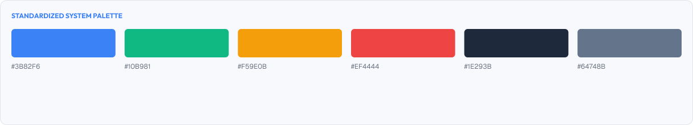
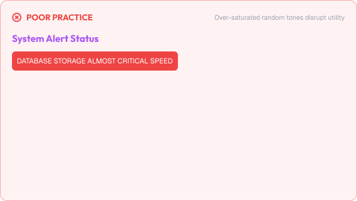
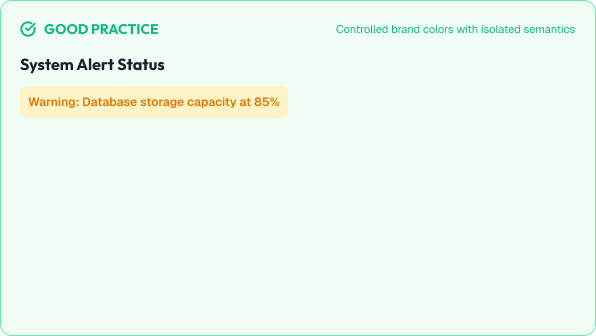

# Color System

Color is one of the most powerful and visually impactful foundations of UI design.

Before creating layouts, components, or visual styles, designers must understand how color communicates meaning, guides attention, and shapes the overall feel of a product.

Color is not just decoration. In UI design, color is a system used to establish hierarchy, convey status, create brand identity, and improve usability.

A strong color system is built around:

* Meaning
* Consistency
* Contrast and accessibility
* Mood and brand

---



# What You'll Learn

In this lesson, you'll learn:

* What color is and why it matters
* Color fundamentals (hue, saturation, lightness)
* How to build a color palette
* Neutrals vs accents
* The 60-30-10 rule
* Semantic colors and their purpose
* Color contrast and WCAG accessibility
* Dark mode design principles
* Common color mistakes
* Accessibility considerations
* How to apply color decisions in real interfaces

---

# What is Color?

Color is the way we perceive light and reflect it across surfaces.

In UI design, color is used to:

* Communicate meaning
* Create hierarchy
* Establish brand identity
* Guide attention
* Set the mood of a product

These functions work together to shape how users understand and feel about an interface.

---

# Why Color Matters

Color impacts user experience on both an emotional and a functional level.

Good color use helps users:

* Understand status instantly (success, error, warning)
* Navigate interfaces with less effort
* Focus on important elements
* Recognize and trust a brand
* Feel the intended mood and atmosphere

Poor color use can lead to:

* Confusing interfaces
* Inaccessible content
* Visual noise
* Misleading status messages
* Low readability

The goal of color is not decoration.

The goal is communication and clarity.

---

# Color Fundamentals

Before building palettes, designers need to understand how digital color works.

## The HSL Model

For UI design, digital color is best understood using the HSL model:

* **Hue** – the type of color (red, blue, green)
* **Saturation** – the intensity of the color
* **Lightness** – how close the color is to white or black

---

## Hue

Hue is the identity of a color and where it sits on the color wheel.

Hue is typically measured in degrees around a 360° wheel:

```text
Red    = 0°
Green  = 120°
Blue   = 240°
```

Hue answers the question: "What color is this?"

---

## Saturation

Saturation controls intensity.

```text
High saturation = vivid, energetic, loud
Low saturation  = muted, calm, quiet
```

Highly saturated colors grab attention but tire the eyes when used over large areas.

---

## Lightness

Lightness controls how close a color is to black or white.

```text
High lightness = light, airy
Low lightness  = dark, heavy
```

Lightness is the value designers adjust most when building shades and choosing text colors.

---

## Common Color Terminology

| Term             | Meaning                                           | Example                                   |
| :----------------- | :------------------------------------------------- | :------------------------------------------ |
| **Primary** | The main brand color for actions and identity    | Brand blue for primary buttons            |
| **Secondary** | Supporting color that pairs with the primary     | A complementary tone for secondary actions |
| **Accent** | A highlight color used sparingly to draw focus   | A yellow highlight on a selected item     |
| **Neutral** | Muted grays used for text, backgrounds, and borders | Grays, off-whites, and near-blacks        |
| **Tint** | A color mixed with white                        | A lighter shade of the primary            |
| **Shade** | A color mixed with black                        | A darker version of the primary           |

---

# Color Palettes

A color palette is a predefined set of colors used consistently across a product.

Instead of choosing colors randomly per screen, designers define a palette that every interface reuses.

A typical palette includes:

* A primary color
* Supporting secondary colors
* Accent colors
* Neutral colors
* Semantic (status) colors

---

## The Role of Neutrals

Most of an interface should rely on neutrals.

Neutrals provide:

* Readable text
* Structured backgrounds
* Visual calm
* Separation between elements

A useful way to think about it:

> Neutrals do the heavy lifting.
>
> Accents do the shouting.

---

## Building a Primary Palette

Start with a single core hue, then create a scale by adjusting lightness in consistent steps.

A common scale uses 10 steps:

```text
50  = lightest
100
200
300
400
500 = base brand color
600
700
800
900 = darkest
```

Each step has a purpose:

* **50–100** – light tints, backgrounds, selected states
* **400–500** – standard brand color in normal use
* **700–900** – text on light backgrounds, hover and pressed states

Named values like "brand.500" are easier to reason about than raw hex codes.

---

## The 60-30-10 Rule

A practical guideline for distributing color across an interface:

```text
60% = Dominant color (usually neutrals)
30% = Secondary color (supporting or brand tones)
10% = Accent color (actions and highlights)
```

Because text and surfaces take up the largest area, most interfaces feel calm and readable, while accent colors stay reserved for the moments that matter.

---

## Color Relationships in Palettes

Palettes are often built using color wheel relationships:

* **Monochromatic** – one hue in many lightness steps, cohesive and safe
* **Analogous** – neighboring hues, harmonious and soft
* **Complementary** – opposite hues, high contrast and energetic

For most UI products:

> Monochromatic neutrals with one well-chosen accent are enough.

Complex multi-hue palettes increase the chance of inconsistency and visual noise.

---

# Semantic Colors

Semantic colors have a fixed, shared meaning across the entire product.

Because their meaning is consistent, users learn them once and understand them everywhere.

## The Common Semantic Set

| Semantic | Typical Color | Meaning                    | Common Use                                |
| :--------- | :-------------- | :--------------------------- | :------------------------------------------ |
| **Primary** | Blue           | Main brand and action      | Primary buttons, links, active states     |
| **Success** | Green          | Completed or confirmed      | Success messages, validation confirmations |
| **Warning** | Amber          | Caution or pending action   | Alerts, unsaved changes, warnings         |
| **Error** | Red            | Failure or incorrect input  | Error messages, destructive buttons       |
| **Info** | Blue           | Neutral helpful information | Tips, updates, help text                  |

---

## Using Semantic Colors Consistently

Success must always look like success — in buttons, badges, toasts, inputs, and tables.

Best practices:

* Give each semantic color its own tint/shade scale
* Keep one set of meanings for the whole product
* Never invent new meanings on the fly

---

## Color Should Never Be the Only Indicator

Color alone fails users who:

* Have color vision deficiencies
* Use low-contrast displays
* Depend on screen readers

Always reinforce color with:

* Icons
* Text labels
* Shape changes
* Weight changes

A success state should include text or an icon, not only a green border.

---

# Color Contrast & Accessibility

Contrast is the difference in perceived lightness between two colors.

Strong contrast is essential for readability and is the most fundamental color accessibility requirement.

## WCAG Contrast Ratios

WCAG (Web Content Accessibility Guidelines) defines contrast as a numeric ratio:

```text
1:1  = no contrast (two identical colors)
21:1 = maximum contrast (black vs white)
```

## Minimum Contrast Requirements

| Content                         | Minimum Ratio |
| :-------------------------------- | :-------------- |
| Normal body text                | **4.5 : 1** |
| Large text (≥24px, or ≥18.66px bold) | **3 : 1** |
| UI components and graphics       | **3 : 1** |

---

## Where Contrast Fails Most Often

* Light gray text on white backgrounds
* Muted labels, placeholders, and captions
* Disabled states that drop below readable contrast
* Low-contrast placeholder text inside inputs

Rule of thumb:

> If you have to squint, the contrast is failing.

Always test text against its exact background color — not just the page background.

---

# Dark Mode Design

Dark mode is not "light mode with inverted colors."

Simply flipping black and white creates harsh, high-contrast screens that are harder to read.

## Core Dark Mode Principles

* Elevated surfaces are **lighter** than the app background
* Text uses **off-white**, not pure white
* Large colored areas are slightly **desaturated**
* Shadows become subtle or disappear, replaced by surface elevation

## Dark Mode Surface Hierarchy

Surfaces communicate depth through lightness steps:

```text
Background (base)   #121212
Surface 1           #1E1E1E
Surface 2           #242424
Surface 3           #2A2A2A
```

The higher the layer, the lighter the surface.

A card should be lighter than the page background so it appears to "float."

---

## What Changes in Dark Mode

| Element              | Light Mode        | Dark Mode                  |
| :--------------------- | :------------------ | :--------------------------- |
| **Text**         | Dark grays         | Off-white light grays       |
| **Background**  | White and light    | Dark grays, never pure black |
| **Shadows**     | Visible drop shadows | Minimal; use surface levels  |
| **Large color fills** | Full saturation   | Slightly desaturated        |
| **Borders**     | Light gray borders | Subtle lighter-toned borders |

---

## Semantic Colors in Dark Mode

Warning and success colors that work on light backgrounds often glow too brightly in dark mode.

Dark variants should:

* Lower lightness slightly so they do not vibrate against dark surfaces
* Keep enough contrast for any text rendered on top
* Be tested, not assumed

---

# Practical Example

Imagine designing an account settings page with a primary action and an error state.

## Poor Color Usage



> A bright purple primary button, a red link, blue headings, random green section titles,
> and a light gray caption that fails contrast on white.

### The Problem

* Every element competes for attention
* The red link distracts from the actual destructive action
* No semantic consistency — colors mean nothing consistently
* The caption is unreadable for many users

---

## Good Color Usage



> A neutral gray layout with one blue primary button.
> The destructive action uses red only where it means "danger."
> A single amber warning explains the unsaved state.
> Captions are a validated gray with sufficient contrast.

### The Result

* Users immediately know what to click
* Status communicates itself without reading
* The interface feels calm, consistent, and accessible

---

# Common Color Mistakes

## Using Too Many Colors

Every color reduces the impact of every other color.

## Low Contrast Text

Muted grays and light text on white fail readability requirements.

## Color as the Only Indicator

Status changes conveyed only by color exclude many users.

## Full Saturation Everywhere

Saturated colors over large areas create visual fatigue.

## Random Colors Per Screen

Inconsistent colors make a product feel unfinished and confusing.

## Treating Dark Mode as an Inversion

Pure black backgrounds and pure white text cause harsh, uncomfortable reading.

---

# Accessibility Considerations

Color should work for all users.

Best practices:

* Meet WCAG contrast minimums (4.5:1 body, 3:1 large text)
* Never rely on color alone to communicate meaning
* Support OS-level dark mode and light mode preferences
* Test for color vision deficiencies
* Keep semantic meanings consistent product-wide

Good color usage improves usability for everyone.

---

# Lesson Checklist

Before moving to the next lesson, make sure you understand:

* What color is and why it matters
* The HSL model (hue, saturation, lightness)
* How to build a color palette
* The role of neutrals
* The 60-30-10 rule
* Semantic colors and their meanings
* Why color should never be the only indicator
* WCAG contrast ratios
* Minimum contrast requirements
* Dark mode principles
* Dark mode surface hierarchy
* Common color mistakes
* Accessibility principles

---