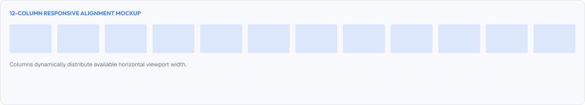
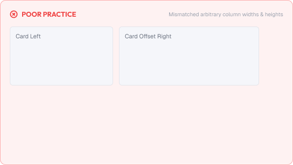
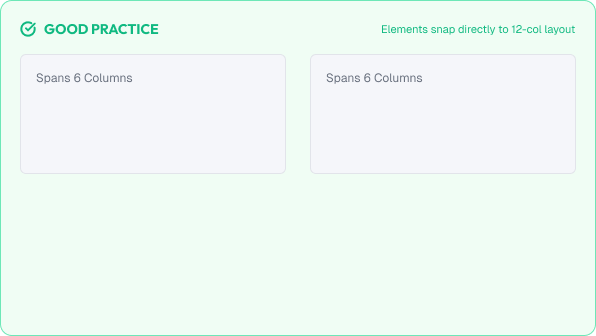

# Grid Systems

A grid system is the structural foundation of any well-organized interface.

Grids help designers place elements consistently, create alignment, and communicate structure across an entire product.

Before positioning content, designers must decide how space is divided. The grid is that decision.

A strong grid system is built around:

* Alignment
* Consistency
* Flexibility
* Predictability

---



# What You'll Learn

In this lesson, you'll learn:

* What a grid is and why it matters
* Grid anatomy (columns, gutters, margins)
* Column counts and common grid types
* Container widths
* Breakpoints and responsiveness
* Baseline grids
* Grid vs flexbox
* Common grid mistakes
* Accessibility considerations
* How to apply grid decisions in real interfaces

---

# What is a Grid System?

A grid system is a framework of intersecting lines used to structure content.

In UI design, a grid defines:

* Where columns start and end
* How much space sits between elements (gutters)
* How much space sits at the page edges (margins)
* How content flows across screen sizes

The grid is invisible, but every element on the page follows it.

---

# Why Grids Matter

Grids bring order to interfaces.

Good grids help users:

* Predict where content appears
* Scan layouts quickly
* Trust the product's consistency

Good grids help designers:

* Align elements without guessing
* Move components between screens safely
* Collaborate with developers clearly

Without a grid, every layout decision is made from scratch and every screen risks looking broken.

---

# Grid Anatomy

Every grid is built from four parts.

## Columns

Columns are the vertical divisions of the grid.

Content sits inside columns.

## Gutters

Gutters are the empty spaces between columns.

Gutters separate content without adding borders.

## Margins

Margins are the empty spaces at the edges of the page or container.

Margins protect content from the screen edges.

## Container

The container is the maximum width that content wraps within.

```text
      Margin
  |-------------|
  |  |  |  |  | |      Columns
  |--|--|--|--|-|      Gutter lines
  |  |  |  |  | |
  |-------------|
      Container
```

---

# Common Grid Types

Several grid types exist. Each serves a different purpose.

| Grid Type      | Common Usage                          | Typical Columns |
| :--------------- | :-------------------------------------- | :---------------- |
| **12-column** | Standard web app & dashboard layouts | 12              |
| **8-column**  | Mobile layouts                       | 8               |
| **24-column** | Complex enterprise dashboards        | 24              |
| **5/7-column** | Specialized editorial layouts        | 5 or 7          |

---

## The 12-Column Grid

The 12-column grid is the most common in UI design.

Why 12?

Because 12 divides evenly into flexible combinations:

```text
12 / 1 = 12 columns (full width)
12 / 2 = 6 columns
12 / 3 = 4 columns
12 / 4 = 3 columns
12 / 6 = 2 columns
```

This makes it easy to build balanced, symmetric layouts.

Example of a 12-column breakdown:

```text
|       8 columns        | 4 columns |
|------ content ------|-- sidebar --|
```

---

# Container Widths

Content should not stretch across the entire screen on large displays.

Common container widths:

| Device       | Typical Container Max Width |
| :------------- | :---------------------------- |
| **Mobile**  | 100% (with safe margins)     |
| **Tablet**  | 768px – 1024px              |
| **Desktop** | 1200px – 1440px             |

Wide screens use centered containers, leaving breathing space at the edges.

---

# Breakpoints and Responsiveness

Grids change behavior across screen sizes.

A grid may use:

* 12 columns on desktop
* 8 columns on tablet
* 4 columns on phone

The same content reflows without redesigning layouts.

Example:

```text
Desktop (12 col):
| 4 | 4 | 4 |

Mobile (4 col):
| 4 |
| 4 |
| 4 |
```

Rules:

* Keep gutters consistent across breakpoints
* Reduce columns, not content quality
* Test layouts at every breakpoint

---

# Baseline Grid

A baseline grid is a horizontal grid based on line-height units.

Typography and vertical spacing align to the same rhythm as horizontal columns.

A common baseline is 8px:

```text
Every vertical gap is a multiple of 8.
```

Combining a column grid and baseline grid creates a fully aligned layout.

---

# Grid vs Flexbox

Two main approaches structure modern CSS layouts.

## Grid

Defines both rows and columns.

Best for:

* Page-level layouts
* Complex 2D structures
* Dashboards

## Flexbox

Defines content along one axis.

Best for:

* Small component arrangements
* Aligning items in a row or column
* Toolbars, navbars

> Use Grid for the page.
>
> Use Flexbox for the pieces inside it.

---

# Practical Example

Imagine designing a dashboard overview.

## Poor Layout



Elements placed at random sizes and positions:

* Cards of inconsistent widths
* No alignment between rows
* Content touching screen edges
* Everything reflows unpredictably on different screens

### The Problem

The interface feels broken and unprofessional. Users cannot predict where content lives.

---

## Good Layout



A 12-column grid with 24px gutters and 24px margins:

* Cards span predictable column spans (3, 4, 6)
* Rows align perfectly
* Content reflows cleanly at each breakpoint
* Consistent spacing everywhere

### The Result

The dashboard feels structured and trustworthy.

Users learn the layout once and it works everywhere.

---

# Common Grid Mistakes

## Too Many Columns

More columns than needed create complexity and overcrowding.

## Fixed Pixel Widths Everywhere

Using fixed widths prevents layouts from adapting to their container.

## Ignoring Gutters

Content that touches its neighbor looks cramped and unaligned.

## Random Column Spans

Irregular spans break the visual rhythm.

## Stretching Content Across Full Width

Oversized lines reduce readability and feel unbalanced.

## Not Testing Breakpoints

A grid that only works at 1440px fails on real screens.

---

# Accessibility Considerations

Grids should support all users.

Best practices:

* Keep enough spacing between interactive elements
* Maintain alignment for consistent scanning
* Avoid layouts that trap content at extreme zoom levels
* Ensure content reflows when text is resized
* Never place interactive content outside safe margins

Good grid structure improves usability for everyone.

---

# Lesson Checklist

Before you move on, make sure you understand:

* What a grid system is
* Why grids matter
* Grid anatomy (columns, gutters, margins, container)
* Common grid types
* The 12-column grid
* Container widths
* Breakpoints and responsiveness
* Baseline grids
* Grid vs flexbox
* Common grid mistakes
* Accessibility principles

---