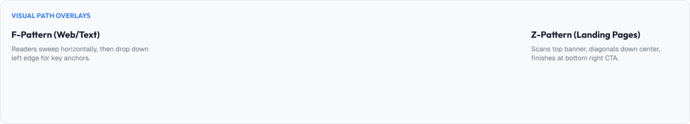
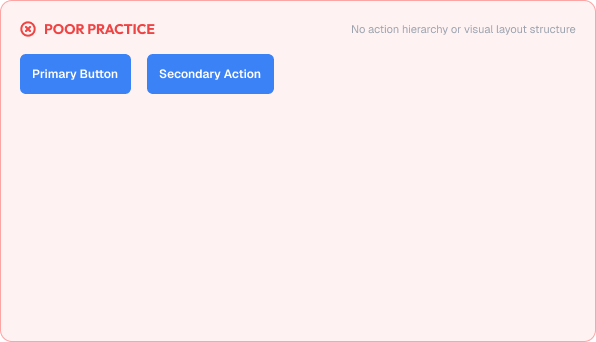

# Layout Principles

A layout is how content is arranged within a screen or container.

Layout is the structure that determines how users perceive, scan, and interact with an interface.

A strong layout is built around:

* Alignment
* Visual balance
* Flow
* Whitespace
* Proximity
* Predictability

---



# What You'll Learn

In this lesson, you'll learn:

* What layout is and why it matters
* The principle of alignment
* Visual balance and weight
* Reading patterns (F-pattern, Z-pattern)
* Whitespace
* Proximity and grouping
* The rule of thirds
* Emphasizing key content
* Common layout mistakes
* Accessibility considerations
* How to apply layout decisions in real interfaces

---

# What is Layout?

Layout is the arrangement of elements within a screen.

Layout controls:

* Where elements sit
* How elements are ordered
* How attention is distributed
* How content breaks into groups

Good layout feels invisible: users focus on the content, not the arrangement.

---

# Why Layout Matters

Layout directly determines how easily users understand an interface.

Good layout helps users:

* Find what they need quickly
* Read in a natural order
* Understand relationships between elements
* Feel calm and in control

Poor layout creates:

* Confusion
* Cognitive load
* Misplaced attention
* Broken trust in the product

---

# Alignment

Alignment is the placement of elements along shared lines.

Even imperfect alignment creates more order than perfect randomness.

## Alignment Lines

Align elements to:

* A shared left edge
* A shared right edge
* A shared center line
* A shared baseline

Example of aligned elements:

```text
| Name        |
| Email       |
| Phone       |
|-------------|
```

Compare to misaligned elements:

```text
| Name   |
|    Email      |
| Phone         |
```

The second list feels chaotic even though the content is the same.

---

## Alignment Guidelines

* Align labels to inputs consistently
* Align buttons to a shared edge
* Use one dominant alignment axis
* Avoid centered text in multi-line blocks

---

# Visual Balance and Weight

Layouts distribute visual weight across the screen.

## Symmetrical Balance

Elements mirror each other on left and right.

Feels formal and stable.

## Asymmetrical Balance

Different elements still feel balanced through size, color, or spacing.

Feels modern and dynamic.

Rule of thumb:

> Place heavy elements close to the center or anchor.
>
> Place light elements toward the edges.

---

# Whitespace

Whitespace is the empty space between and around elements.

Whitespace is not wasted space. It is a design material.

Whitespace:

* Separates groups
* Gives content room to breathe
* Communicates importance
* Reduces cognitive load

Example with insufficient whitespace:

```text
Name Email Phone Save
```

Example with effective whitespace:

```text
Name  Email  Phone

[ Save ]
```

The second version is far easier to scan and understand.

---

# Reading Patterns

Users scan screens in predictable patterns.

## The F-Pattern

Used for text-heavy pages and tables.

Users scan:

* Top line fully
* Left side partially
* Again in a rough F shape

Best for dashboards and articles.

## The Z-Pattern

Used for pages with a few key messages.

Users scan:

* Top left to top right
* Diagonal to bottom left
* Bottom left to bottom right

Best for landing pages and hero sections.

Understanding these patterns helps place the most important content where eyes land first.

---

# Proximity and Grouping

The Principle of Proximity from Gestalt psychology states:

> Elements close together are perceived as related.

Layout uses proximity to create groups without borders or labels.

Example:

```text
First Name   Last Name
Email        Phone
```

The pairings read as natural groups.

Keep related content close and separate unrelated groups with whitespace.

---

# The Rule of Thirds

Divide the screen into thirds horizontally and vertically:

```text
| 1 | 2 | 3 |
| 4 | 5 | 6 |
| 7 | 8 | 9 |
```

Points of interest sit near the intersections (4, 6, 8, 2).

Used heavily in photography and image-heavy layouts to place focal points.

---

# Emphasizing Key Content

Every screen should have one primary call to action or focal point.

Avoid giving every element equal visual weight.

A layout communicates priority through:

* Size
* Color
* Contrast
* Position (top-left / top-center first)
* Whitespace around an element

Rule:

> If everything is emphasized, nothing is emphasized.

---

# Practical Example

Imagine designing a check-out screen.

## Poor Layout



* All buttons the same size and color
* Fields misaligned
* No whitespace between sections
* Shipping and payment sections blended together
* "Place Order" buried at the bottom with no emphasis

### The Problem

Users cannot tell primary from secondary actions, and the screen feels stressful.

---

## Good Layout


* Clear section headers with adequate spacing
* Aligned fields and labels
* The primary "Place Order" button taller and more prominent
* Related fields grouped by proximity
* One focal action per screen

### The Result

Users understand the flow instantly, fill the form confidently, and reach the primary action without hesitation.

---

# Common Layout Mistakes

## Centered Everything

Centered text and elements make interfaces feel unanchored.

## Equal Weight for Everything

No visual hierarchy leaves users scanning aimlessly.

## Ignoring Whitespace

Cramped layouts increase cognitive load.

## Misaligned Elements

Misalignment signals a broken or unfinished design.

## Mixed Alignment Systems

Using left, right, and center alignment together creates chaos.

## Poor Reading Flow

Content ordered in a way that fights natural scanning patterns.

---

# Accessibility Considerations

Layout should support all users.

Best practices:

* Provide clear keyboard focus order
* Keep content readable when zoomed
* Avoid cluttered high-density screens
* Use proximity consistently for grouping
* Ensure touch targets have enough space

Good layout improves usability for everyone.

---

# Lesson Checklist

Before you move on, make sure you understand:

* What layout is
* Why layout matters
* Alignment principles
* Visual balance and weight
* Whitespace
* F-pattern and Z-pattern
* Proximity and grouping
* The rule of thirds
* Emphasizing key content
* Common layout mistakes
* Accessibility principles

---