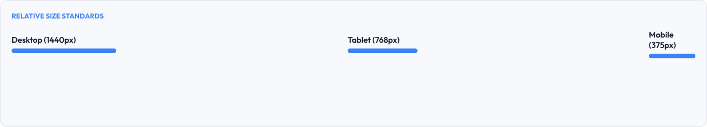
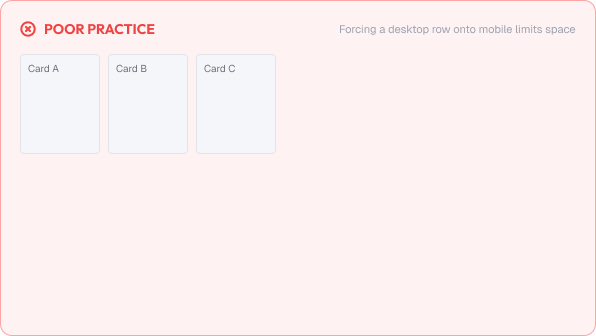
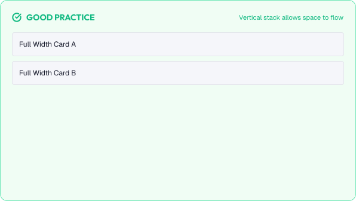

# Responsive Breakpoints

Responsive design ensures an interface adapts to any screen size.

Breakpoints are the width thresholds where a layout changes to match the screen.

A strong responsive system is built around:

* Adaptability
* Consistency
* Content-first thinking
* Predictability

---



# What You'll Learn

In this lesson, you'll learn:

* What responsive design is and why it matters
* What breakpoints are
* Common breakpoint values
* Mobile-first vs desktop-first
* Fluid layouts
* Handling navigation and touch targets
* Testing breakpoints
* Common responsive mistakes
* Accessibility considerations
* How to apply breakpoints in real interfaces

---

# What is Responsive Design?

Responsive design is the practice of building one interface that works across all screens.

Instead of separate mobile and desktop versions, a single design reflows:

* Content stacks or widens
* Components resize
* Navigation adapts
* Touch targets grow

The goal:

> One codebase, one design, every screen.

---

# What Are Breakpoints?

Breakpoints are predefined screen widths where layout behavior changes.

Below a breakpoint, content collapses.

Above a breakpoint, content expands.

```text
Mobile      < 768px   stacked, single column
Tablet      768–1024px   two columns
Desktop     > 1024px   full layout, multi-column
```

---

## Common Breakpoints

Many design systems use a small set of breakpoints.

| Breakpoint Name | Min Width  | Common Usage                     |
| :---------------- | :----------- | :--------------------------------- |
| **Mobile**   | 375px      | Phones                            |
| **Tablet**   | 768px      | Tablets, small laptops            |
| **Desktop**  | 1024px     | Standard laptops & desktops       |
| **Large Desktop** | 1440px     | Wide monitors and large screens   |

---

## Why So Few Breakpoints?

Too many breakpoints create unstable, hard-to-maintain layouts.

A small set of well-tested breakpoints is more consistent.

> Design at breakpoints, but never let layout break between them.

---

# Mobile-First vs Desktop-First

Two approaches define how breakpoints are written.

## Mobile-First

Design for the smallest screen first, then add features as screens grow.

```text
Base (mobile) → min-width: 768px → min-width: 1024px
```

Pros:

* Forces focus on essentials
* Writes cleaner, progressive CSS
* Aligns with most web traffic

## Desktop-First

Design for the largest screen first, then simplify on smaller screens.

```text
Base (desktop) → max-width: 1024px → max-width: 768px
```

Still common, but requires more care to prioritize.

> Mobile-first is the modern default recommendation.

---

# Responsive Patterns

Common patterns used to adapt layouts.

## Stacking

Cards and columns collapse into a single column on small screens.

```text
Desktop:  | A | B | C |
Mobile:   | A |
          | B |
          | C |
```

## Fluid Widths

Containers use percentages instead of fixed pixels so they scale continuously.

```text
width: 100%  → fills any screen
width: 480px → fixed, may overflow
```

## Reactive Components

Components change internally at breakpoints:

* A table becomes cards
* A horizontal nav becomes a menu
* Side-by-side inputs stack vertically

---

# Navigation and Touch Targets

Navigation is the most-breakpoint-sensitive part of an interface.

Breakpoints govern:

* When a hamburger menu appears
* When tabs wrap
* When a sidebar collapses

Guidelines:

* Keep touch targets at least 44×44px on touch devices
* Give navigation adequate spacing in stacked mode
* Ensure the hidden menu is reachable by keyboard

---

# Testing Breakpoints

Layouts break where designers least expect it.

Test at:

* Every defined breakpoint
* Middle sizes between breakpoints
* Common device sizes (375, 768, 1024, 1440)
* Maximum zoom and text-only resizing

Use the browser's responsive tool and real devices.

---

# Practical Example

Imagine a product page with a sidebar, main content, and footer.

## Poor Responsive Behavior



* The sidebar stays visible on mobile, crushing content
* Side-by-side inputs overflow on small screens
* The nav menu is empty until an invisible trigger
* Fixed widths cause horizontal scrolling

### The Problem

The mobile experience feels like a broken desktop page.

---

## Good Responsive Behavior



* The sidebar collapses once the screen reaches the tablet breakpoint
* Inputs stack into single-column mode on phones
* The nav becomes a clean hamburger menu
* Content fills the screen at every size

### The Result

The same product feels native on every device, with no awkward gaps.

---

# Common Responsive Mistakes

## Too Many Breakpoints

Every extra threshold adds complexity.

## Fixed Widths and Heights

Fixed dimensions overflow and clip on smaller screens.

## Testing Only at Breakpoints

Middle sizes are where layouts actually break.

## Unreachable Navigation

Hidden menus that require a gesture users cannot perform.

## Ignoring Touch

Mouse-sized targets fail on touch screens.

## Not Testing Real Content

Empty text and short content hide overflow problems.

---

# Accessibility Considerations

Responsive design should serve everyone.

Best practices:

* Support zoom up to 200% without breaking layout
* Keep keyboard navigation working at every breakpoint
* Ensure touch targets meet minimum sizes
* Never hide important content on small screens
* Maintain contrast and readability at all sizes

Good responsive design is accessible by default.

---

# Lesson Checklist

Before you move on, make sure you understand:

* What responsive design is
* Why it matters
* What breakpoints are
* Common breakpoint values
* Mobile-first vs desktop-first
* Fluid vs fixed sizing
* Responsive patterns (stacking, reflow)
* Navigation and touch targets
* Testing methodology
* Common responsive mistakes
* Accessibility principles

---