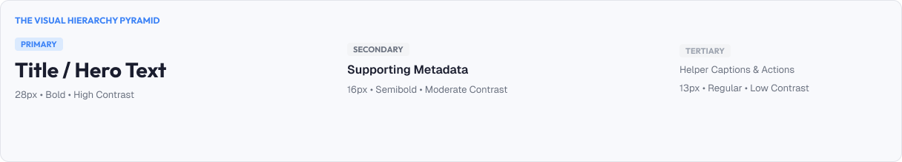
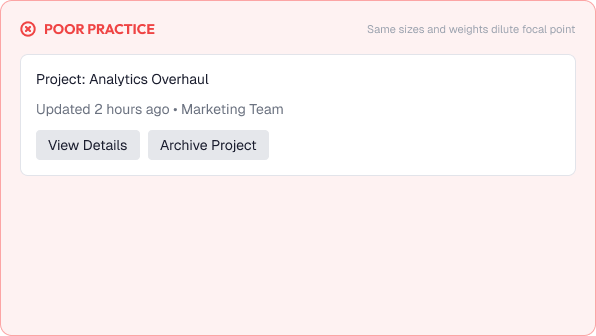
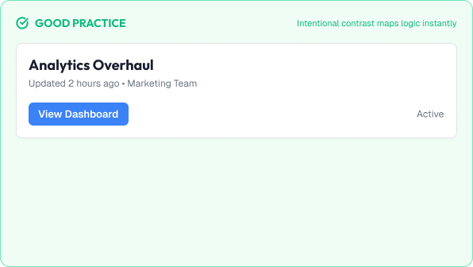

# Visual Hierarchy

Visual hierarchy is the arrangement of elements to signal which content matters most.

Users do not read interfaces in order. They scan. Hierarchy decides what their eyes find first.

A strong hierarchy is built around:

* Priority
* Contrast
* Scale
* Position
* Spacing
* Consistency

---



# What You'll Learn

In this lesson, you'll learn:

* What visual hierarchy is and why it matters
* How contrast creates priority
* How scale communicates importance
* How position guides attention
* How spacing and proximity shape groups
* Gestalt principles in hierarchy
* Creating a single dominant element
* Common hierarchy mistakes
* Accessibility considerations
* How to apply hierarchy in real interfaces

---

# What is Visual Hierarchy?

Visual hierarchy is the deliberate ordering of visual importance.

Hierarchy answers:

* What do I look at first?
* What do I look at second?
* What is supporting information?

Good hierarchy guides users to the answer in seconds.

Poor hierarchy leaves users scanning endlessly.

---

# Why Visual Hierarchy Matters

Users form opinions about a page in a fraction of a second.

Good hierarchy helps users:

* Find key actions instantly
* Understand structure without reading
* Complete tasks faster
* Trust the product

Poor hierarchy causes:

* Missed actions
* Confusion about importance
* Higher cognitive load
* Frustration

The ultimate goal:

> When everything is important, nothing is important.

---

# Creating Hierarchy

Hierarchy is created by controlling visual differences.

The human eye is drawn to elements that stand out.

---

## 1. Contrast

Contrast is the strongest hierarchy tool.

Elements that differ most in color, weight, or brightness draw the eye first.

```text
High contrast:  Dark heading on light card
Low contrast:   Faded caption text
```

Use strong contrast for primary content.

Save low contrast for secondary metadata.

---

## 2. Scale

Larger elements appear more important.

```text
Title       (largest)
Subtitle    (medium)
Body        (smaller)
Caption     (smallest)
```

Scale is the foundation of typographic hierarchy.

---

## 3. Position

Elements placed higher and to the left (for LTR languages) get more attention.

```text
Primary action   → top right region, prominent
Secondary action → below or beside the primary
```

Position also creates reading flow (F-pattern, Z-pattern).

---

## 4. Spacing and Proximity

Whitespace around an element makes it prominent.

```text
Important item:
    (large gap around it)

Related items:
    grouped tightly together
```

Less space implies connection. More space implies separation.

---

## 5. Color

Color can prioritize elements.

* A single accent color on one button draws the eye
* Muted neutrals recede
* Too many colors flatten the hierarchy

> Use color sparingly so it remains meaningful.

---

# Gestalt Principles of Grouping

Hierarchy works because of how the brain groups elements.

| Principle | Meaning                                   | Example                        |
| :---------- | :------------------------------------------ | :------------------------------- |
| **Proximity** | Close elements are related              | Field labels near their inputs |
| **Similarity** | Similar elements belong together        | All buttons share a style      |
| **Continuity** | Aligned elements form a path            | A vertical form reads as one flow |
| **Closure** | The mind completes incomplete shapes    | Card corners imply boundaries  |

These principles let designers create order without heavy borders or labels.

---

# One Dominant Element

Every screen should have a clear focal point.

A focal point is the single element the eye lands on first.

Example:

```text
Dashboard:

  Total Revenue     ← dominant (large number, accent color)

  Other metrics     ← supporting (smaller, muted)
```

If two things compete for "most important", the hierarchy feels weak.

Rule of thumb:

> Give the primary action the highest contrast, the largest size, or the most whitespace — not all three at once.

---

# Practical Example

Imagine designing a project page.

## Poor Hierarchy



* Every heading is the same size
* All buttons are the same style
* Hero numbers are small and gray
* Caption text is darker than the main content

### The Problem

Nothing stands out. Users cannot tell what to read or click, and the page feels flat.

---

## Good Hierarchy



* A large, bold page title
* A prominent "New Project" button in the brand color
* Key metrics displayed larger with clear contrast
* Supporting details smaller and muted

### The Result

Users immediately know the topic, the key data, and the primary action.

The hierarchy explains the page before a single word is read.

---

# Common Hierarchy Mistakes

## Flat Design

All elements with identical weight produce no focal point.

## Too Many Focal Points

Competing highlights dilute each other.

## Contrast That Contradicts Importance

Decorative elements overpower essential content.

## Inconsistent Scales

Random sizes confuse which level is which.

## Relying Only on Color

Order is lost for users who cannot distinguish those colors.

## Borders Everywhere

Overly structured layouts bury emphasis in dividers.

---

# Accessibility Considerations

Hierarchy must work for all users.

Best practices:

* Maintain contrast between text and background
* Reinforce hierarchy with size, not color alone
* Provide logical reading order
* Ensure screen readers encounter a sensible order
* Keep focus order aligned with visual priority

Good hierarchy improves comprehension for everyone.

---

# Lesson Checklist

Before you move on, make sure you understand:

* What visual hierarchy is
* Why it matters
* Contrast as a priority tool
* Scale and size
* Position and reading flow
* Spacing and proximity
* Color usage
* Gestalt principles
* Creating one dominant element
* Common hierarchy mistakes
* Accessibility principles

---