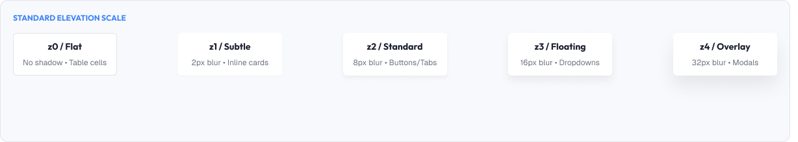
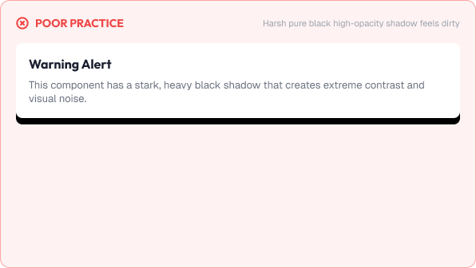
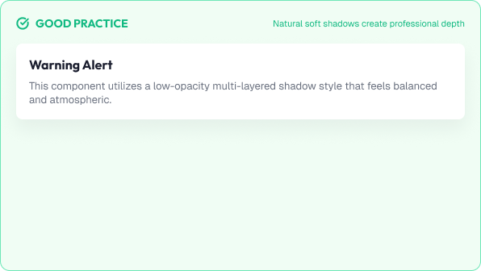

# Shadows & Elevation

Shadows give interfaces depth, showing which elements sit above others.

Elevation is the sense of height a surface has relative to its surroundings.

A strong elevation system is built around:

* Layering
* Consistency
* Readability
* Performance

---



# What You'll Learn

In this lesson, you'll learn:

* What shadows are and why they matter
* What elevation means in UI design
* How shadows create depth
* Shadow anatomy (offset, blur, spread, color, opacity)
* Elevation levels
* When to use flat, subtle, and strong shadows
* Dark-mode shadows
* Common shadow mistakes
* Accessibility considerations
* How to apply elevation in real interfaces

---

# What are Shadows?

A shadow is a visual cue that one layer sits above another.

Shadows help users understand relationships:

* A floating menu sits above page content
* A modal sits above everything
* A card sits above the background

Without shadows, overlapping elements become impossible to separate.

---

# What is Elevation?

Elevation is the perceived height of an element above its container.

Elevation creates a surface model:

```text
Background    = z0  (sits lowest)
Cards         = z1  (slightly raised)
Menus/Popups  = z2  (float above content)
Modals        = z3  (highest level)
```

Each level should have a consistent, recognizable shadow.

---

# Shadow Anatomy

A shadow is made of several properties.

## Offset

How far the shadow shifts from the shape.

```text
offset-x  = horizontal distance
offset-y  = vertical distance
```

A downward offset suggests light from above.

## Blur

How soft the shadow edges are.

```text
Small blur = hard, sharp shadow (close layer)
Large blur = soft, diffuse shadow (higher layer)
```

## Spread

How much the shadow grows beyond the shape.

## Color and Opacity

Shadows are rarely pure black.

```text
Black at 30% opacity → harsh, heavy
Black at 12% opacity → soft, natural
```

A good shadow is:

```text
y-offset: 4px
blur: 16px
color: black at 10–15% opacity
```

---

# Elevation Levels

Most design systems define a small set of elevation levels.

| Level | Purpose            | Example Shadow                       |
| :------ | :------------------- | :------------------------------------- |
| **z0** | Base surface       | None (flat)                          |
| **z1** | Resting cards      | `0 1px 2px rgba(0,0,0,0.08)`         |
| **z2** | Hover, dropdowns   | `0 4px 8px rgba(0,0,0,0.12)`         |
| **z3** | Popups, menus      | `0 8px 16px rgba(0,0,0,0.16)`        |
| **z4** | Modals, toasts     | `0 16px 32px rgba(0,0,0,0.24)`       |

Fewer levels keep shadows predictable.

---

# Depth Without Confusion

Shadows must not fight the content.

Guidelines:

* Raise only what needs attention
* Keep ambient shadows subtle
* Combine elevation with layer color when possible
* Never use shadows in place of spacing

A useful mental model:

> Elevation separates layers.
>
> Spacing separates content.

---

# Interactive Elevation

Elevation can change with interaction.

Common pattern:

```text
Card (resting):   low shadow
Card (hover):     higher shadow (feels lifted)
Card (active):    lower shadow (feels pressed)
```

This micro-feedback confirms interactivity.

Keep the lift small enough to feel responsive, not distracting.

---

# Shadows in Dark Mode

Dark backgrounds make shadows nearly invisible.

Dark mode options:

* Use **slightly lighter surfaces** to separate layers
* Use **ambient shadows** with higher opacity
* Prefer **surface tone** changes over heavy blur

Example dark-mode elevation:

```text
Background: #121212
Card:       #1E1E1E  (difference = elevation)
```

> In dark mode, color does more work than shadow.

---

# Visual Examples





---
# Common Shadow Mistakes

## Too Heavy

Intense black shadows make interfaces feel dirty or gimmicky.

## Too Many Levels

Every element with a different shadow destroys consistency.

## Shadows on Everything

Flat components like buttons need minimal or no shadow.

## Ignoring Dark Mode

Shadows that fail on black render elements invisible.

## Blur That Blurs the Content

Excessive blur softens edges and reduces focus.

## 3D Looks

Shadows with extreme offsets make UI feel like a toy.

---

# Accessibility Considerations

Elevation should support all users.

Best practices:

* Never rely on shadow alone to separate critical information
* Keep shadows subtle so they do not reduce focus
* Ensure color contrast between stacked layers
* Support reduced-motion preferences
* Test on low-power and low-resolution displays

Elevation improves clarity for everyone when used with restraint.

---

# Lesson Checklist

Before you move on, make sure you understand:

* What shadows are
* What elevation means
* How depth communicates relationships
* Shadow anatomy
* Elevation levels
* Interactive elevation
* Dark-mode shadows
* Common shadow mistakes
* Accessibility principles

---