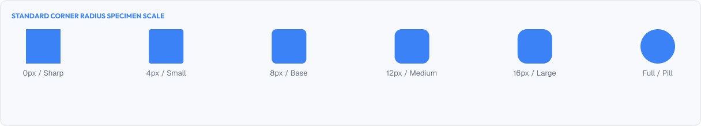
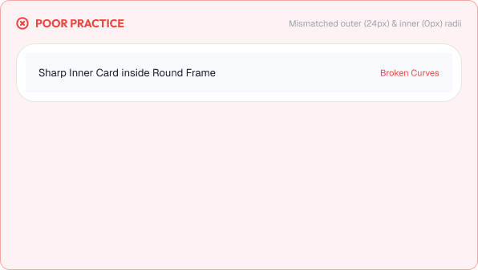
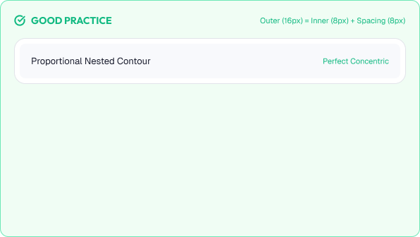

# Corner Radius & Shape Language

Corner radius shapes the personality of an interface.

Rounded corners feel friendly and approachable. Sharp corners feel precise and professional.

A strong shape language is built around:

* Consistency
* Personality
* Scalability
* Usability

---



# What You'll Learn

In this lesson, you'll learn:

* What corner radius is and why it matters
* How readability and comfort are affected
* Radius scales and tokens
* Shape personality
* Radius and different elements
* Pill vs circle shapes
* Consistency across products
* Common radius mistakes
* Accessibility considerations
* How to apply radius in real interfaces

---

# What is Corner Radius?

Corner radius is the amount of rounding applied to a corner.

```text
radius 0px  → sharp corner
radius 8px  → gently rounded corner
radius 999px (full) → pill / circle shape
```

Radius is one of the three main shape attributes, along with size and elevation.

It is part of the product's design language and affects how users feel about the product.

---

# Why Corner Radius Matters

Radius shapes first impressions.

* Rounded corners feel safe, friendly, and modern
* Sharp corners feel formal, technical, and precise

Radius also has functional effects:

* Rounder buttons appear easier to tap
* Very round shapes signal "clickable" chips and pills
* Consistent radius makes components feel part of one family

---

# Radius Scale and Tokens

Professional systems define a small set of radius tokens.

| Token        | Value  | Common Usage                          |
| :------------- | :------- | :-------------------------------------- |
| **none**  | 0px     | Tables, data grids, some editors       |
| **sm**    | 4px     | Small inputs, compact controls         |
| **md**    | 8px     | Cards, buttons, dropdowns (default)    |
| **lg**    | 12px    | Large cards, dialogs                   |
| **xl**    | 16px+   | Floating panels, sheets                |
| **full**  | half the element size | Pills, avatars         |

A general rule:

> Use **8px** for most components.
>
> Use **4px** for small and dense elements.
>
> Use **larger radius** only for large surfaces and hero areas.

---

# Shape Personality

Radius should match product personality.

| Personality | Suggested Radius        |
| :------------- | :------------------------ |
| Friendly, playful | Large radius (12px – pill) |
| Professional   | 4px – 8px                |
| Technical / dense | 0px – 4px              |
| Premium / elegant | Confident 8px – 12px  |

Consistency across a product matters more than any single value.

> Choose a radius system once, then apply it everywhere.

---

# Radius by Element Type

Not every element needs the same radius.

## Buttons

Buttons typically use:

```text
Medium radius (4–8px)
or Full radius (pill) for emphasis
```

## Cards

Cards use medium radius to define their boundary.

## Inputs

Inputs generally match button radius so rows feel aligned.

## Avatars and Badges

Avatars and badges are always fully rounded (circles).

## Modals and Sheets

Modals and side sheets use large radius on the visible corners.

---

# Radius and Readability

Radius affects how easily the eye moves through a layout.

- High contrast between radiuses can feel broken
- Too much rounding on dense data reduces precision
- Consistent radius makes scanning easier

Rule:

> The more content a surface holds, the smaller its radius tends to be.

---

# Visual Examples





---
# Common Radius Mistakes

## Mixing Random Radiuses

Different families across the app make the design feel unprofessional.

## Over-Rounding Large Surfaces

Extremely rounded huge cards can look cartoonish.

## Sharp Corners on Interactive Elements

Buttons with 0 radius can feel uninviting to tap.

## Inconsistent Pill Buttons

Pills styled differently from other buttons break the language.

## Radius Applied Only to One Theme

Radius must stay consistent in light and dark modes.

---

# Accessibility Considerations

Radius should support usability.

Best practices:

* Keep touch targets large regardless of how rounded they are
* Avoid radius that cuts off focus outlines
* Keep clickable shapes clearly defined
* Test focus visibility on rounded elements
* Make sure rounded corners do not overlap content on small screens

Good shape language improves usability for everyone.

---

# Lesson Checklist

Before you move on, make sure you understand:

* What corner radius is
* Why radius matters
* Radius scale and tokens
* Shape personality
* Radius by element type
* Pill vs circle shapes
* Consistency and readability
* Common radius mistakes
* Accessibility principles

---