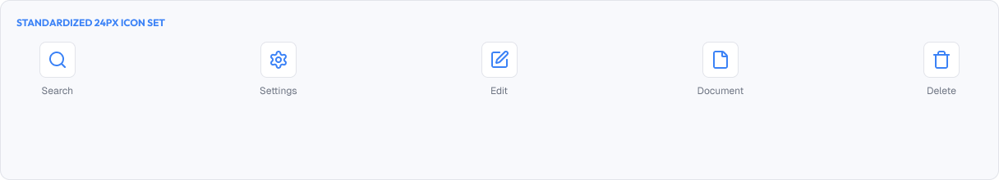
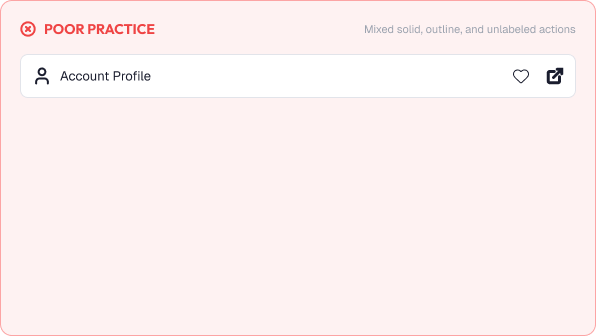
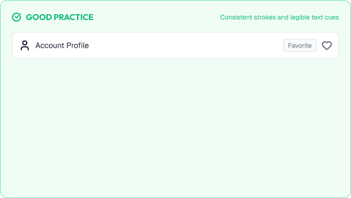

# Iconography Basics

Icons are small visual symbols that communicate ideas quickly.

A good icon helps users act without reading a word.

A strong iconography system is built around:

* Clarity
* Consistency
* Simplicity
* Recognizability

---



# What You'll Learn

In this lesson, you'll learn:

* What icons are and why they matter
* The purpose of icons
* When to use icons
* Anatomical properties (stroke, style, grid)
* Icon styles (outline, filled, duotone)
* Recognizable metaphors
* Icon vs text labels
* Common icon mistakes
* Accessibility considerations
* How to apply icons in real interfaces

---

# What is an Icon?

An icon is a simplified visual representation of an action, object, or idea.

Examples:

* A trash can → delete
* A magnifying glass → search
* A house → home

Icons work because users recognize common metaphors instantly.

---

# Why Icons Matter

Icons speed up navigation and comprehension.

Icons help users:

* Scan interfaces faster
* Identify actions without reading
* Recognize patterns from other products
* Feel confident before clicking

Icons also help:

* Save screen space
* Support multilingual users
* Reinforce text labels

---

# The Purpose of an Icon

Icons serve one of three roles:

## Action

Represents an action the user can perform.

```text
✏️ Edit   🗑️ Delete   ➕ Add
```

## Status

Represents a system state.

```text
⚠️ Warning   ✅ Success   ❓ Help
```

## Identification

Represents a category, feature, or object.

```text
📄 Documents   📊 Reports   👤 Profile
```

Choose the right role, then choose the right glyph.

---

# When to Use Icons

Icons work best when:

* The metaphor is universally understood
* The action area is already large enough to tap
* An icon + text label is possible for critical actions

Icons fail when:

* The meaning is ambiguous
* Two similar icons are used together
* The icon is too small to recognize
* Users must guess what it means

> When in doubt, pair the icon with a text label.

---

# Icon Styles

Icon styles define how glyphs are drawn.

## Outline (Stroke) Icons

Lines only.

* Clean, modern, light
* Common in SaaS products

## Filled Icons

Solid shapes.

* Heavier visual weight
* Good for active states and emphasis

## Duotone Icons

Two-tone filled icons.

* Distinctive personality
* Used for brand emphasis

## Key Rule

Pick one icon style and use it everywhere.

Mixing outlines and filled icons in one interface looks inconsistent.

---

# Icon Personality

Icons are drawn with a consistent voice.

Consistent properties:

* Stroke weight
* Corner rounding
* Grid alignment
* Optical size

A system with matching stroke weight feels unified.

Example consistent strokes:

```text
Stroke: 2px
Corners: rounded 2px
```

---

# Recognizable Metaphors

Use icons users already know.

Clear examples:

* 🔍 Search → magnifying glass
* 🏠 Home → house
* ⚙️ Settings → gear
* 📅 Calendar → calendar sheet

Ambiguous examples:

* A "gear" double used for settings and debug
* A "plus" used for add and expand
* A "bell" used for notifications and alerts

> Reuse the same icon for the same meaning everywhere.

---

# Icons and Text Labels

Icons rarely replace text for critical actions.

Best practice pattern:

* Low-risk actions may use icons alone once users learn them
* Critical actions should include a text label
* Icon + label is the safest and most accessible default

```text
Preferred:   [🗑 Delete]
Acceptable:  [🗑]
```

---

# Practical Example

Imagine a file list with actions.

## Poor Iconography



* An outline icon and a filled icon used together
* The same gear icon for settings and debugging
* A large, ambiguous "plus" with no label
* Icons of different stroke weights next to each other

### The Problem

Users guess what each icon does, slowing every task.

---

## Good Iconography



* All icons share the same 2px rounded stroke style
* Each meaning maps to one icon used consistently
* The "Add" action shows an icon and a text label
* Hover states include tooltips for full clarity

### The Result

Users act confidently and learn the system quickly.

---

# Common Icon Mistakes

## Unclear Metaphors

Icons users have to think twice about.

## Mixed Styles

Outline and filled icons mixed in one screen.

## Icons Only for Important Actions

No label on critical actions reduces confidence.

## Too Many Icons

Every piece of text gets an icon, creating noise.

## Missing Alt / Accessible Name

Icons that disappear for screen reader users.

## Misuse of Status Icons

Warning icons used for non-dangerous decoration.

---

# Accessibility Considerations

Icons should work for all users.

Best practices:

* Provide text alternatives for screen readers
* Use icons with text labels for critical actions
* Maintain enough size and stroke contrast
* Never depend on color alone in an icon
* Test icon recognition with real users

Good icons improve usability for everyone.

---

# Lesson Checklist

Before you move on, make sure you understand:

* What icons are
* Why icons matter
* The role of icons (action, status, identification)
* When to use icons
* Icon styles (outline, filled, duotone)
* Icon personality (stroke, corners, grid)
* Recognizable metaphors
* Icon vs text labels
* Common icon mistakes
* Accessibility principles

---