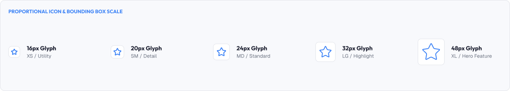

# Icon Sizing & Consistency

Icons must be sized and aligned consistently across an interface.

Randomly sized icons make layouts feel shakier than any other component issue.

A strong icon system is built around:

* Consistent dimensions
* Alignment precision
* Visual weight balance
* Predictability

---



# What You'll Learn

In this lesson, you'll learn:

* Why icon size matters
* Standard icon sizes
* The icon grid
* Optical sizing vs mathematical sizing
* Stroke weight and size
* Alignment within buttons and lists
* Spacing around icons
* Consistency rules
* Common sizing mistakes
* Accessibility considerations
* How to apply icon sizing in real interfaces

---

# Why Icon Size Matters

Size affects both recognition and touch.

Too small:

* Icons get lost
* Detail is invisible
* Touch targets fail

Too large:

* Icons overwhelm the interface
* Visual noise increases
* Layouts look unbalanced

A consistent size keeps icons comfortable and predictable.

---

# Standard Icon Sizes

Most design systems use a small set of icon sizes.

| Icon Size | Common Usage                     |
| :---------- | :---------------------------------- |
| **16px** | Interface actions in dense lists  |
| **20px** | Secondary in-content actions      |
| **24px** | Common standard icon size        |
| **32px** | Header-level and larger emphasis  |
| **48px** | App icons, avatars (full shapes)  |

Example:

```text
24px = default system icon
16px = inside small buttons and tables
32px = feature highlights
```

> Pick two or three sizes and use only those.

---

# The Icon Grid

Icons are designed inside a consistent grid.

Common grids:

* 24×24 frame (most common)
* 16×16 frame for small UI
* 32×32 for larger display

Inside the grid, key properties stay consistent:

```text
Safe area:   center with margin
Stroke:      2px
Corner:      rounded 2px
```

Designing on a grid means icons align across the whole product.

---

# Optical vs Mathematical Size

Icon math is not always the same as how big an icon looks.

A square icon and a thin line icon of the same dimensions have different visual weight.

Optical correction may be needed:

```text
Square shape: slightly reduced to match
Thin shape:   slightly enlarged to match
```

The goal is optical balance, not identical numbers.

---

# Stroke Weight and Size

Stroke weight must scale with icon size.

As icons grow:

* Stroke weight can stay ~2px for small sizes
* Or scale proportionally for larger sizes

Keep these consistent:

```text
16px icon → 2px stroke
24px icon → 2px stroke
32px icon → 3px stroke (optional)
```

> The same logical stroke across sizes keeps the family unified.

---

# Alignment Within Controls

Icons must sit optically centered within buttons and lists.

## In Buttons

```text
[ icon  25px ]   ← icon centered in padding
[ Label       ]
```

## In Lists

```text
● Item 1      →  16px icon at leading edge
● Item 2
```

Alignment rules:

* Align icons to the same vertical center as text
* Keep a consistent gap between icon and text (8px default)
* Match icon alignment to the layout grid

---

# Icon vs Text Alignment

When icons pair with text:

* Vertically center the icon against the text's cap height, not the full line width
* Keep consistent horizontal padding
- Add consistent gap (usually 8px)

Example:

```text
icon [gap] Label    →  gap is always consistent
```

---

# Spacing Around Icons

Give icons breathing room.

* Icon-only buttons need generous padding
* Icon inside text needs consistent margin
* Touch targets should stretch beyond just the icon size

```text
Target (44px)      ← hit area
   [icon 24px]     ← visible glyph
```

The visible icon is small; the touchable area is larger.

---

# Practical Example

Imagine a toolbar with actions.

## Poor Sizing

> **Visual Example (placeholder)**
>
> **What to show:** A toolbar mixing 16px and 24px icons, icons touching each other and misaligned inside their buttons.
> 
> Add an illustrative image of the Poor example, for example:
>
> ```text
> 
> ```

* One action icon at 16px, one at 24px
* Icons not centered inside their buttons
* Icons touching each other
* Stroke weights vary between icons

### The Problem

The toolbar looks uneven, and users hesitate to click smaller icons.

---

## Good Sizing

> **Visual Example (placeholder)**
>
> **What to show:** A toolbar of uniform 24px icons with 8px gaps, optically centered inside 44px touch targets.
> 
> Add an illustrative image of the Good example, for example:
>
> ```text
> 
> ```

* All icons at 24px viewBox, 2px stroke
* Consistent 8px gap between icons
* Buttons sized to the touch target (44px)
* All icons optically centered within their frames

### The Result

The toolbar reads as one clean, confident unit.

---

# Common Sizing Mistakes

## Random Icon Sizes

Different icon dimensions scattered on one screen.

## Icons That Overflow

Icons larger than their containers clip or crowd content.

## Misaligned Icons

Icons sitting at inconsistent vertical or horizontal positions.

## Icon-Only Targets Too Small

Visible glyph fits, but the tap area is too small.

## Inconsistent Stroke Weight

Matching sizes that still look different because strokes differ.

---

# Accessibility Considerations

Icon sizing must work for everyone.

Best practices:

* Use sufficient light-weight strokes that remain legible
* Provide touch targets ≥ 44px around icon-only actions
* Maintain contrast between icon and background
* Include accessible names for icon-only controls
* Keep icon sizes consistent to build recognition

Good icon sizing improves usability for everyone.

---

# Lesson Checklist

Before you move on, make sure you understand:

* Why icon size matters
* Standard icon sizes
* The icon grid
* Optical vs mathematical sizing
* Stroke weight consistency
* Alignment within buttons and lists
* Spacing around icons
* Consistency rules
* Common sizing mistakes
* Accessibility principles

---