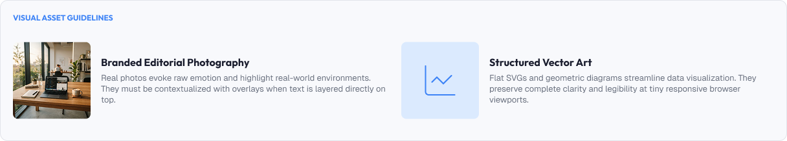
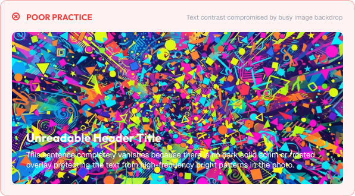
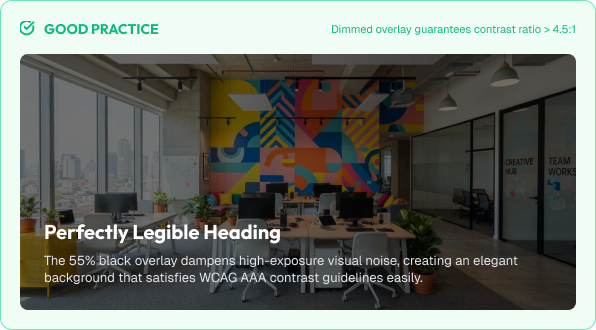

# Imagery & Illustration Guidelines

Images and illustrations add emotion, context, and personality to interfaces.

Used well, imagery supports content. Used poorly, it distracts and slows interfaces.

A strong imagery system is built around:

* Purpose
* Consistency
* Quality
* Accessibility
* Performance

---



# What You'll Learn

In this lesson, you'll learn:

* What imagery means in UI design
* Types of imagery (photos, illustrations, icons)
* When to use photos vs illustrations
* Visual consistency across media
* Cropping and framing
* Image quality and resolution
* Reducing visual noise
* Text over images
* Accessibility: alt text and contrast
* Common imagery mistakes
* How to apply imagery in real interfaces

---

# What is Imagery?

Imagery refers to the visual media used to support an interface.

This includes:

* Photographs
* Illustrations
* Icons
* Charts and diagrams
* Videos and GIFs

Imagery is the fastest way to communicate emotion and context.

---

# Why Imagery Matters

Imagery shapes first impressions.

Good imagery helps users:

* Feel the product's personality
* Understand complex ideas quickly
* Trust the brand
* Stay engaged

Poor imagery causes:

* Distraction
* Slow loading
* Confusion between decoration and content
* Broken trust

---

# Types of Imagery

## Photographs

Photos bring reality, humanity, and emotion.

Best for:

* People and products
* Editorial and marketing
* Real-world context

## Illustrations

Illustrations bring a controlled, stylized, and branded look.

Best for:

* Empty states
* Onboarding
* Conceptual ideas
* Brand-focused products

## Icons

Icons are functional symbols.

Best for:

* Navigation and actions
* Status and identification

---

# Photos vs Illustrations

How to choose?

| Consideration      | Photos            | Illustrations          |
| :------------------- | :------------------ | :------------------------ |
| **Mood**       | Realistic, human  | Playful, branded, conceptual |
| **Consistency** | Varies by source  | Easy to keep consistent |
| **Cost**       | Stock or licensing | Requires illustration talent |
| **Context**    | Products, people, places | Empty states, abstractions |

General rule:

> Use photos for real-world content.
>
> Use illustrations for abstract or emotional ideas.

---

# Visual Consistency

All imagery in a product should feel part of one family.

Consistent factors:

* Color treatment (filters, overlays, saturation)
* Lighting and mood
* Composition style
* Illustration line weight and palette
* Icon style

Strict rules (examples):

```text
Photos: consistent warm tone + subtle overlay
Illustrations: 2 accent colors + neutral base
Icons: 2px rounded stroke, filled/outline style fixed
```

---

# Cropping and Framing

How an image is cropped changes its meaning and fit.

## Aspect Ratios

Common ratios:

```text
1:1  (square)   thumbnails, avatars
4:3  (classic)  editorial content
16:9 (widescreen) heroes and banners
3:2            product galleries
```

Use consistent ratios across a set (e.g., all cards 16:9).

## Safe Zones

Keep important subjects away from edges so cropping is safe.

---

# Image Quality and Resolution

Images must look sharp at every size.

Guidelines:

* Use the largest practical file that still loads fast
* Serve images sized to their container (no upscaling)
* Use modern formats (WebP/AVIF) for web
* Provide responsive image variants for small screens

Loading performance matters:

> A great image that loads slowly is a bad image.

---

# Reducing Visual Noise

Images compete with other content for attention.

Helpful practices:

* Add subtle overlays or scrims on hero images
* Keep card images consistent in tone
- Reduce busy backgrounds behind text
- Prefer one dominant image per view, not many

---

# Text Over Images

Text on images needs careful handling.

Guidelines:

* Add a dark overlay or gradient behind text
* Keep enough contrast between text and image
* Keep hero text shorter than plain paragraphs
* Provide an accessible alternative

```text
Image:
  +-------------------+
  |   [dark scrim]    |
  |   White heading   |
  +-------------------+
```

If contrast fails, move text off the image entirely.

---

# Practical Example

Imagine an onboarding screen.

## Poor Imagery



* A busy, high-contrast stock photo behind text
* Text unreadable without a dark background
* Illustrations randomly colored, unlike the brand
* Four different illustration styles across screens

### The Problem

The visual noise overwhelms the message, and the screens feel unrelated.

---

## Good Imagery



* A calm, cropped illustration in brand colors
* Text on a neutral surface with safe margin
* The same illustration style on every onboarding step
* One emotion per screen

### The Result

The onboarding feels cohesive, branded, and easy to absorb.

---

# Common Imagery Mistakes

## Random Sources / Styles

Mixed photo and illustration styles feel unprofessional.

## Unreadable Text Over Images

Text without a scrim fails for everyone.

## Unoptimized Files

Heavy images slow the interface.

## Distracting Imagery

Busy visuals that compete with the content.

## Meaningless Decoration

Images that add no information or emotion.

## Ignoring Alt Text

Images that vanish for screen reader users.

---

# Accessibility Considerations

Imagery should support all users.

Best practices:

* Provide descriptive alt text for informative images
* Mark decorative images as decorative (empty alt)
* Ensure text over images meets contrast
* Respect reduced-motion preferences
* Never rely on imagery alone to convey content

Good imagery improves the experience for everyone.

---

# Lesson Checklist

Before you move on, make sure you understand:

* What imagery means in UI
* Types of imagery
* Photos vs illustrations
* Visual consistency
* Cropping and framing
* Quality and resolution
* Reducing visual noise
* Text over images
* Common imagery mistakes
* Accessibility principles

---