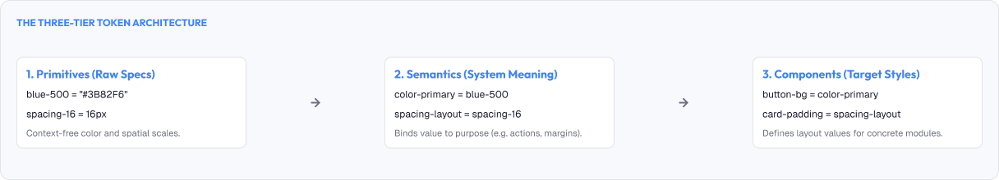
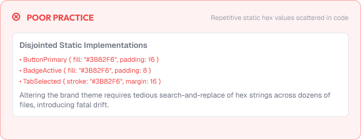
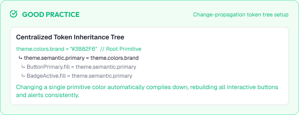

# Design Tokens

Design tokens are the smallest building blocks of a design system.

Instead of naming styles like "blue" or "16px", tokens give every value a meaningful, reusable name.

A strong token system is built around:

* Consistency
* Abstraction
* Scalability
* Collaboration

---



# What You'll Learn

In this lesson, you'll learn:

* What design tokens are
* Why tokens matter
* Token naming and structure
* Primitive vs semantic tokens
* Common token categories
* Theming with tokens
* Tokens across platforms
* How tokens improve collaboration
* Common token mistakes
* Accessibility considerations
* How to apply tokens in real projects

---

# What are Design Tokens?

A design token is a named value that stands for a single design decision.

Examples:

```text
color.brand.500  = #3B82F6
spacing.md       = 16px
font.size.body   = 16px
radius.sm        = 4px
```

Tokens replace scattered hard-coded values:

```text
Before:  background: #3B82F6
After:   background: var(--color-brand-500)
```

---

# Why Tokens Matter

Tokens centralize design decisions.

They help:

* Keep values consistent across an entire product
* Make changes in one place instead of dozens of files
* Give values meaningful names instead of magic numbers
* Enable theming (light, dark, brand variants)
* Let designers and developers share one source of truth

> A single source of truth keeps design and code aligned.

---

# Primitive vs Semantic Tokens

Tokens are organized into two layers.

## Primitive Tokens

Raw values, named by their attributes.

Examples:

```text
color.blue.500  = #3B82F6
color.gray.100  = #F3F4F6
space.300       = 24px
font.medium     = 500
```

Primitives describe what something IS.

## Semantic Tokens

Purpose-based tokens that reference primitives.

Examples:

```text
color.background.default  = color.gray.100
color.action.primary      = color.blue.500
text.color.body           = color.gray.900
spacing.card.padding      = space.300
```

Semantic tokens describe what something DOES.

---

## Why Two Layers?

The layers decouple meaning from value.

If a product changes its primary color:

```text
color.action.primary = color.blue.500
→
color.action.primary = color.green.600
```

Only the semantic token changes. Components never need updating.

---

# Token Structure and Naming

Good tokens follow a predictable naming structure.

Common pattern:

```text
category.attribute.state
```

Examples:

```text
color.background.hover
color.text.disabled
spacing.gap.sm
font.weight.bold
radius.corner.md
elevation.shadow.md
```

---

## Naming Rules

* Use lowercase with consistent separators
* Be consistent across all categories
* Use meaningful category names
* Prefer fewer, clearer tokens over many fuzzy ones

Avoid:

```text
blue
dark
gray2
secondaryBlue
paddingBig
```

---

# Common Token Categories

| Category   | Meaning                                   | Example                 |
| :------------ | :------------------------------------------ | :------------------------ |
| **Color** | Everything color                         | `color.brand.500`       |
| **Spacing** | Sizes, gaps, padding, margins            | `spacing.gap.md`        |
| **Typography** | Font family, size, weight, line height | `font.size.lg`          |
| **Radius** | Corner radius                            | `radius.sm`             |
| **Elevation** | Shadows and depth                       | `elevation.md`          |
| **Opacity** | Transparency levels                      | `opacity.disabled`      |
| **Motion** | Durations and easing curves              | `motion.duration.fast`  |
| **Z-index** | Layering order                           | `z-index.modal`         |

---

# Theming with Tokens

Tokens enable multiple themes from one codebase.

A theme is a set of values bound to the semantic tokens.

Light theme:

```text
color.background.default = #FFFFFF
color.text.body          = #1F2937
```

Dark theme:

```text
color.background.default = #121212
color.text.body          = #E5E7EB
```

Components reference only semantic tokens, so both themes work without changes.

---

# Tokens Across Platforms

Tokens travel from design tools to code.

Common flow:

```text
Design tool (Figma)
    ↓ exports
Token file (JSON / YAML)
    ↓ transforms
Platform artifacts (CSS variables, Tailwind, Android, iOS)
```

A shared token file becomes the single source of truth.

---

# Practical Example

Imagine changing a product's brand color from blue to green.

## Without Tokens



Teams hunt through dozens of files and components, updating each hex code manually.

Missed spots create inconsistent "blue stragglers" for months.

## With Tokens



One primitive value changes:

```text
color.brand.500 = #3B82F6 → #16A34A
```

Every component updates automatically. The brand refresh is done in one edit.

---

# Common Token Mistakes

## Too Many Tokens

Hundreds of tokens are harder to maintain than dozens.

## Overly Specific Names

Tokens named for one component can't be reused.

## Skipping the Semantic Layer

Components tied directly to primitives can't be themed.

## Inconsistent Naming

Similar tokens named differently across teams.

## Tokens as Magic Numbers

Unreadable names that don't describe the decision.

---

# Accessibility Considerations

Tokens carry accessibility decisions.

Best practices:

* Store accessible contrast colors as semantic tokens
* Align disabled/muted tokens with WCAG requirements
* Ensure semantic color tokens are the only thing components use
* Test theme swaps against contrast rules

Good tokens make accessible defaults easier to enforce.

---

# Lesson Checklist

Before you move on, make sure you understand:

* What design tokens are
* Why tokens matter
* Primitive vs semantic tokens
* Token naming structure
* Common token categories
* Theming with tokens
* Tokens across platforms
* How tokens improve collaboration
* Common token mistakes
* Accessibility principles

---