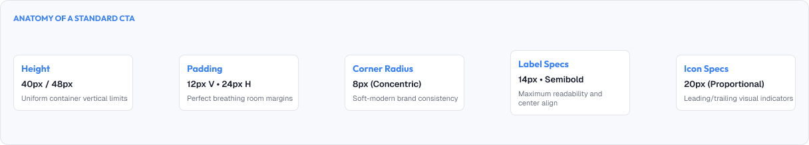
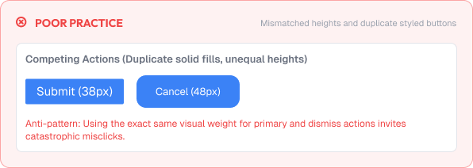
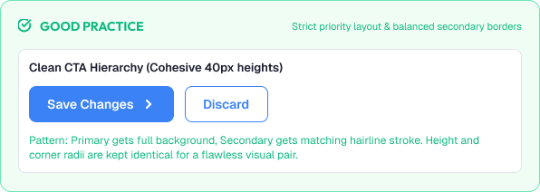

# Component Anatomy: Buttons

Buttons are the most important interactive components in an interface.

They are where users take action, so their anatomy must be precise, comfortable, and consistent.

A strong button system is built around:

* Clarity of purpose
* Consistent anatomy
* Clear states
* Accessibility
* Touch & density

---



# What You'll Learn

In this lesson, you'll learn:

* What a button is
* Button anatomy (padding, label, container, icon)
* Types of buttons
* Height and touch targets
* Label and typography
* Icon buttons
* Spacing and density
* Button hierarchy (primary, secondary, tertiary)
* Common button mistakes
* Accessibility considerations
* How to build buttons as reusable components

---

# What is a Button?

A button is a control that triggers an action.

Buttons differ from links:

```text
Button = action (save, submit, delete)
Link   = navigation (go to profile)
```

Users should always know: tapping this will DO something.

---

# Button Anatomy

A button is built from a few consistent parts.

```text
┌─────────────────────────────┐
│  [icon]  Label   (optional) │   ← content
└─────────────────────────────┘
   ↑                        ↑
 padding                  padding
```

Parts:

* **Container** – the clickable surface (color, border, radius)
* **Label** – what the button does
* **Icon** – optional visual reinforcement
* **Padding** – internal comfort space
* **States** – hover, focus, active, disabled

---

# Button Height & Touch

Buttons must be easy to tap and click.

Standard heights:

```text
Large:  44–48px  (default desktop actions)
Medium: 36–40px  (dense UI, compact)
Small:  32px     (only where needed)

Minimum touch target: 44×44px
```

A good default desktop button:

```text
Height: 40px
Padding: 12–16px horizontal
Radius: 8px
```

---

# Button Typography

Button text has its own typographic rules.

Guidelines:

* Use sentence case, not all caps
* Keep labels short and concrete ("Save changes", not "Submit")
* Use one consistent weight (medium or semibold)
* Vertical center the label perfectly

Example label standards:

```text
font-size: 14px or 16px
font-weight: 500–600
color: matches button style
line-height: matches button height
```

---

# Icons in Buttons

Icons support buttons when relevant.

```text
[ icon ] Add item      ← icon before label
[ icon ]               ← icon-only button
```

Rules:

* Keep a consistent gap (8px) between icon and label
* Icon-only buttons must have an accessible name
* Give icon-only buttons a proper hit area

---

# Button Hierarchy

Buttons communicate importance through visual weight.

## Primary Button

Filled, high contrast.

For the main action on a screen.

## Secondary Button

Outlined or softer.

For supporting actions.

## Tertiary / Ghost Button

Borderless text button.

For low-emphasis actions.

Example hierarchy on a dialog:

```text
[ Cancel ]  [ Save ]     ← Save is primary
```

> Every screen should usually have ONE primary button.

---

# Button vs Other Actions

Buttons must look distinct from other controls.

- Don't style links/checkboxes to look like buttons
- Don't let every button compete for primary status
- Keep destructive and positive actions visually separated

---

# Practical Example

Imagine a settings dialog with Save and Cancel.

## Poor Button Anatomy



* Buttons of inconsistent heights
* The primary button styled identical to the secondary
* Icon dangles with uneven spacing
* Hover states offset the whole button

### The Problem

Users cannot tell which action is intended, and the buttons feel fiddly.

---

## Good Button Anatomy



* One primary filled button, one secondary outlined button
* Both 40px tall with matched, generous padding
* Sentence-case labels, centered
* Consistent 8px gap in the icon button
* Identical height and radius, differing only in fill

### The Result

The primary action is obvious, the buttons feel cohesive, and the component is reusable.

---

# Common Button Mistakes

## Inconsistent Heights

Buttons that don't line up break layout rhythm.

## Tiny Touch Targets

Small buttons frustrate touch users.

## All-Caps Labels

Shouty, harder to scan text.

## Too Many Primary Buttons

Competing filled buttons dilute importance.

## Missing States

No hover, focus, or disabled feedback.

## Icons That Float

Uneven icon spacing around labels.

---

# Accessibility Considerations

Buttons should serve all users.

Best practices:

* Provide visible focus outlines
* Ensure contrast ratios for filled and text styles
* Use real `<button>` elements for semantics
* Keep labels descriptive (accessible name from text)
* Maintain adequate touch targets

Good button anatomy improves usability for everyone.

---

# Lesson Checklist

Before you move on, make sure you understand:

* What a button is
* Button anatomy
* Height and touch targets
* Button typography
* Icon usage
* Button hierarchy (primary/secondary/tertiary)
* Common button mistakes
* Accessibility principles

---