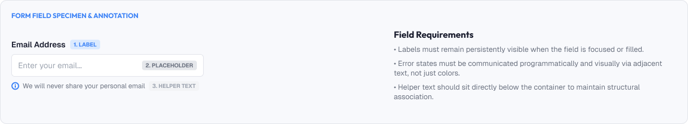
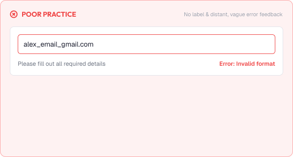
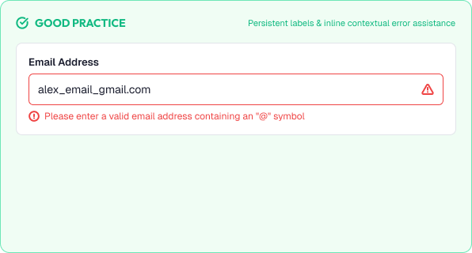

# Component Anatomy: Inputs & Forms

Inputs let users enter and edit data.

A good input is instantly recognizable, comfortable to use, and clear about what belongs inside.

A strong input system is built around:

* Recognizability
* Clarity
* Comfort
* Consistency
* Accessibility

---



# What You'll Learn

In this lesson, you'll learn:

* What an input is
* Input anatomy (container, label, placeholder, icons, metadata)
* Input types (text, textarea, select, checkbox, radio, toggle, search)
* Labels and placeholder text
* Input height and padding
* Help text and validation states
* Input vs button contrast
* Common input mistakes
* Accessibility considerations
* How to build inputs as reusable components

---

# What is an Input?

An input is a control where users provide or edit data.

Types include:

```text
Text        → free-form text
Textarea    → multi-line text
Select      → choose from a list
Checkbox    → multiple selections
Radio       → single selection
Toggle      → on/off
Search      → search term
Date / Number → specific formats
```

Each type communicates its own behavior.

---

# Input Anatomy

The parts of an input field.

```text
      Label
    ┌──────────────────────┐
    │  placeholder / value  │  ← field
    └──────────────────────┘
         Helper text
         Validation message
```

Parts:

* **Label** – what the field asks for
* **Field** – the editable surface (border, fill, radius)
* **Placeholder** – example of content (optional)
* **Value** – what the user entered
* **Helper text** – supporting guidance
* **Validation** – success/error feedback

---

# Labels

Labels carry the meaning of a field.

Guidelines:

* Always provide a visible label for critical fields
* Keep labels short and specific
* Place labels above or consistently beside fields (above is safer)
* Label every field — never rely on placeholder alone

Example:

```text
Email address          ← label
─────────────────
you@example.com        ← placeholder (not a label)
```

> A placeholder is ghost text, not a label.

---

# Placeholders

Placeholders hint at example content.

Best practices:

* Use them as examples, not as the only label
* Keep them genuinely helpful ("you@example.com")
* Keep contrast slightly lower than real text, but not unreadable
* Never put format instructions needed to complete a task

---

# Field Height & Padding

Inputs need room to breathe and be tapped.

Standard sizes:

```text
Medium:   40–44px tall
Compact:  32–36px
Horizontal padding: 12–16px
Radius:   matches button radius (4–8px)
```

Consistency rule:

> Inputs and buttons in the same row should share height and radius.

---

# Input vs Button Harmony

When inputs sit next to buttons, they must feel like one system.

```text
[ expression …… ] [ Go ]
    40px
```

Same height, radius, and visual language.

---

# Helper Text & States

Inputs show states clearly.

```text
Default:  neutral border, hint text
Focus:    accent border + outline
Error:    red border + error message
Success:  green border + confirmation
Disabled: reduced color, no interaction
```

State rules:

* Never rely on color alone (pair with text/icon)
* Keep errors and helper text near the field
* Debug: label → field → helper/error beneath

---

# Input Types That Need Care

## Selects

Native selects are accessible out of the box.

Keep options meaningful and ordered.

## Checkboxes & Radios

Large enough hit area around the control.

Group radios so only one selection is possible.

## Toggles

Label the state ("Notifications ON/OFF") — a toggle alone is ambiguous.

## Search

Provide a clear search field with icons that don't overlap the text.

---

# Practical Example

Imagine a sign-up form.

## Poor Input Anatomy



* Placeholders used as the only labels
* Inputs and the submit button at different heights
* Error text appears far from the field it belongs to
* Error uses color alone
* Fields have inconsistent left alignment

### The Problem

Users guess what to enter, feel unsure, and receive confusing feedback.

---

## Good Input Anatomy



* Every field has a visible label above it
* All inputs 40px tall, same radius, aligned left
* Helper text under the field, error messages adjacent
* Errors include a message and an icon
* Submit button shares the height and alignment of the fields

### The Result

The form feels effortless and users complete it with confidence.

---

# Common Input Mistakes

## No Labels

Users don't know what to enter.

## Placeholder as Label

Text disappears the moment typing starts.

## Tiny Fields

Hard to see and impossible to tap.

## Misaligned Inputs

Broken rows and inconsistent margins.

## Error Feedback Too Late or Too Far

Users discover problems after submitting.

## Resizing on Focus

Inputs that shift layout when focused.

---

# Accessibility Considerations

Inputs must work for everyone.

Best practices:

* Associate labels with fields (for screen readers)
* Provide visible focus indicators
* Maintain contrast for placeholder and helper text
* Use proper input types for mobile keyboards
* Announce validation errors

Good inputs improve usability for all users.

---

# Lesson Checklist

Before you move on, make sure you understand:

* What an input is
* Input anatomy
* Input types
* Labels vs placeholders
* Field height and padding
* Helper text and states
* Input/button harmony
* Common input mistakes
* Accessibility principles

---