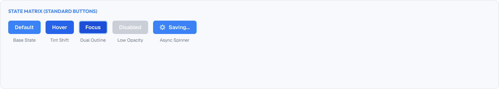
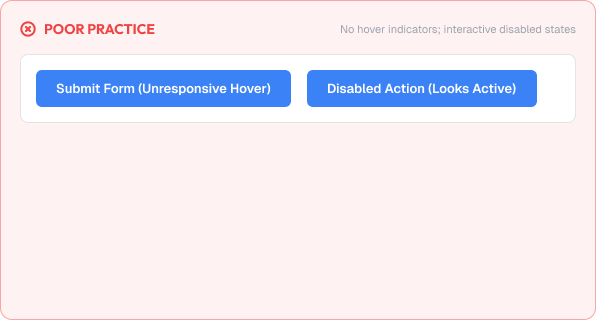
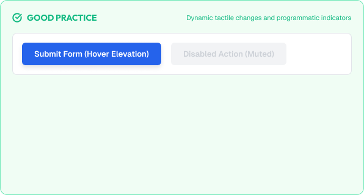

# Component States

Every interactive component responds to the user.

The set of responses — default, hover, focus, active, disabled — is the state system.

A strong state system is built around:

* Feedback
* Consistency
* Discoverability
* Accessibility

---



# What You'll Learn

In this lesson, you'll learn:

* What component states are
* Why states matter
* The core states (default, hover, focus, active, disabled)
* Designing each state
* State transitions
* Loading states
* State and color/contrast
* Common state mistakes
* Accessibility considerations
* How to implement state systems

---

# What are Component States?

A state is the visual representation of a component's condition at a moment in time.

Common states:

```text
default      resting
hover        pointer on top
focus        keyboard/touch focused
active       pressed / in use
disabled     unavailable
loading      working
```

Consistent states teach users what is interactive and confirm responses.

---

# Why States Matter

States give feedback.

Good state design helps users:

* Know what is clickable
* Understand what they just did
* Recognize disabled options
* Navigate confidently

Missing states cause:

* Uncertain clicks
* Wondering if the click worked
* Confusion about available options

> Every action should be acknowledged by the interface.

---

# The Core States

## Default

The resting appearance of the component.

Must always be clear.

## Hover

Hover communicates interactivity.

Rules:

* Subtle, reinforcement — not a dramatic change
* Slightly different background, border, or shadow
* No layout shift

## Focus

Focus shows keyboard/touch selection.

Rules:

* Always present for keyboard users
* Usually a visible outline or ring
* Never removed or hidden

## Active / Pressed

Pressed state acknowledges a click.

Rules:

* Often darker background or slight "press down" effect
* Immediate response
* Distinct from hover

## Disabled

Disabled signals unavailability.

Rules:

* Clearly muted (reduced opacity / gray)
* Keep enough contrast to be visible
* Never interactive

---

# Designing Each State

Standard transformations look like this:

```text
Default:   bg #F9FAFB, border gray
Hover:     bg #E5E7EB
Focus:     outline ring (2px)
Active:    bg #D1D5DB (pressed)
Disabled:  opacity 0.5, cursor not-allowed
```

For a filled primary button:

```text
Default:  brand 500
Hover:    brand 600
Active:   brand 700
Focus:    brand 500 + visible ring
Disabled: gray 300
```

---

# State Transitions

States should feel smooth, not abrupt.

Transition guidance:

```text
Duration: 100–200ms
Easing:   ease-out (fast in, settle)
Property: background, color, shadow, transform

Only animate subtle properties.
```

Avoid:

* Large layout changes on hover
* Slow, distracting transitions
- Animating every property

---

# Loading States

When actions take time, show loading.

Patterns:

* Disabled button + spinner while processing
* Skeleton screens for content load
* Progress indicators for long operations

Rules:

* Keep the component present (no disappearing layout)
* Prevent duplicate submissions while loading
* Provide clear messaging when it finishes

---

# State Color & Contrast

States must remain readable and accessible.

Guidelines:

* Keep text/border contrast within each state
* Never drop below WCAG contrast on important text
* Disabled states can be lower contrast but still distinguishable

> If a hover state makes text unreadable, the state is broken.

---

# Practical Example

Imagine a Save button in an editor.

## Poor States



* Hover and default look identical
* No visible focus ring (keyboard users can't tell where they are)
* Pressed state just flashes
* While saving, the button disappears
* Disabled button looks the same as default

### The Problem

Users can't tell what's clickable, selected, or in progress.

---

## Good States



* Default → hover → active follow a subtle darkening scale
* Focus shows a visible outline ring
* While saving, the button stays in place and shows a spinner + "Saving…"
* Disabled is clearly muted

### The Result

Every interaction is acknowledged, and the interface feels alive and trustworthy.

---

# Common State Mistakes

## Missing Hover

No hover implies the element is not interactive.

## Removing Focus

Vanishing focus rings break keyboard users.

## Layout Shift on Hover

Moving content during a state change is jarring.

## Unreadable Disabled

Disabled that is too faint to notice or too dark to ignore.

## Inconsistent State Sets

Some buttons show hover, others don't.

## No Pending/Loading State

Users click repeatedly while waiting.

---

# Accessibility Considerations

States must be perceivable for everyone.

Best practices:

* Never suppress focus indicators
* Announce state changes to screen readers (aria)
* Keep animations subtle; honor reduced motion
* Use more than color to signal state changes
* Provide visible contrast for "selected" states

Good states improve usability for all users.

---

# Lesson Checklist

Before you move on, make sure you understand:

* What component states are
* Why states matter
* Default, hover, focus, active, disabled
* Loading states
* State transitions
* Color and contrast in states
* Common state mistakes
* Accessibility principles

---