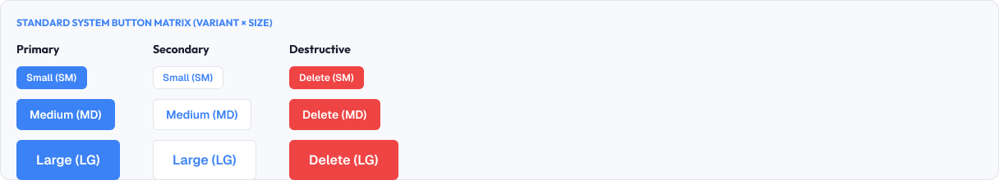
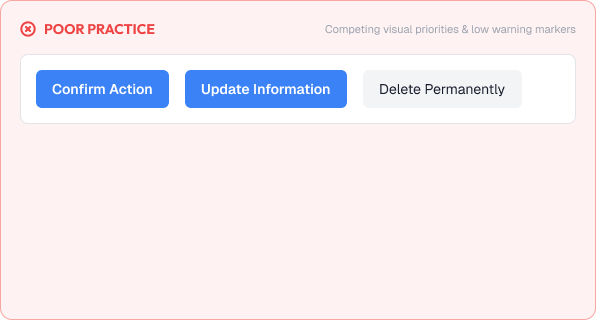
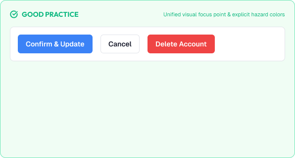

# Component Variants & Sizes

Components come in variations to fit different contexts.

Variants control style; sizes control scale. Both must stay consistent and predictable.

A strong variant system is built around:

* Purpose
* Hierarchy
* Consistency
* Scalability
* Accessibility

---



# What You'll Learn

In this lesson, you'll learn:

* What variants are
* What sizes are
* Variant types (primary, secondary, destructive, ghost)
* Size scales (sm, md, lg)
* How variants and sizes combine
* Managing component density
* Consistency across a system
* Common variant mistakes
* Accessibility considerations
* How to design reusable component matrices

---

# Variants vs Sizes

Two independent dimensions describe a component.

## Variant

A change in style or emphasis.

```text
primary    → filled, brand color
secondary  → outlined or soft
ghost      → borderless text
destructive → signals danger
```

## Size

A change in scale.

```text
sm   → compact
md   → standard
lg   → prominent
```

When combined, they form a matrix:

```text
                 sm          md         lg
primary      [fill sm]   [fill md]   [fill lg]
secondary    [out sm]    [out md]    [out lg]
ghost        [ghost sm]  [ghost md]  [ghost lg]
```

---

# When to Use Each Variant

## Primary

One primary action per screen.

High visual weight.

## Secondary

Supporting or alternative actions.

Less emphasis.

## Ghost / Tertiary

Low-emphasis actions, often inline.

## Destructive

Actions that delete or permanently change.

Distinct danger styling, clearly separated from other actions.

---

# Size Semantics

Sizes should map to real contexts.

```text
sm   → dense rows, tables, secondary UI
md   → standard mid-weight surfaces (default)
lg   → main actions, hero, prominent UI
```

Guidelines:

* Use md as the default so sizes stay consistent
* Reserve sm for genuinely dense spaces
* Use lg sparingly for important moments

> Size should carry meaning, not just look different.

---

# How Variants Work Together

When two variants sit together, emphasize clearly.

```text
Dialog footer:

[ Secondary ]  [ Primary ]

↳ one leading action
```

Avoid two equally strong buttons in one group.

Rules:

* Primary + secondary is the most common pairing
* Never place two primaries side by side
* Separate destructive actions from negative-default actions

---

# Size & Touch Targets

Sizes must preserve usability.

Minimum touch target:

```text
44 × 44px preferred
40 × 40px acceptable compact
```

If `sm` dips below touch limits, expand the hit area to the minimum touch target even when the visible box is smaller.

---

# Density

Sizes also control density.

| Density | Use                                  |
| :-------- | :------------------------------------- |
| Compact | Data tables, dense dashboards        |
| Comfortable | Standard applications (default)     |
| Spacious | Marketing, empty states, onboarding  |

Rules:

* Let users choose density where data-heavy
* Keep spacing tokens aligned to the grid (8px steps)
* Never mix density levels within one screen

---

# Variant Consistency Across Components

The same variant should mean the same thing everywhere.

```text
primary button  ==  primary emphasis
primary nav tab ==  primary emphasis
```

If the visual weight differs per component, users lose intuition.

Guidelines:

* Define variants at the design-system level, once
* Reuse the same color/contrast tokens for each variant
* Audit components so "primary" always reads as primary

---

# Practical Example

Imagine a file manager toolbar.

## Poor Variant Design



* Two filled primary buttons for contradictory actions
* Sizes randomly mixed (a 32px ghost next to a 48px primary)
* Destructive "Delete" looks identical to "New Folder"
* No mid-size level, so compact UI feels cramped

### The Problem

Users can't tell which action dominates, and the toolbar feels random.

---

## Good Variant Design



* One primary "New Folder" action, one secondary "Upload"
* "Delete" distinct and reserved
* Consistent sizes (md for toolbar, sm for row-level actions)
* Clear touch targets everywhere

### The Result

The toolbar reads instantly, and users act with confidence.

---

# Common Variant Mistakes

## Too Many Variants

Endless variants destroy consistency.

## Two Primaries Together

Competing actions confuse hierarchy.

## Random Size Mixing

Breaking the size matrix within one view.

## Weak Size Differentiation

Sizes that differ by 1px read as accidental.

## Destructive Not Distinct

Danger actions camouflaged as normal ones.

## Sizes That Break Touch

Compact variants with unusable targets.

---

# Accessibility Considerations

Variants and sizes must serve everyone.

Best practices:

* Keep contrast across all variant styles
* Preserve touch targets even at small sizes
* Keep destructive styling distinct, not just color-coded
* Provide visible focus on every variant & size
* Document variant semantics for screen readers

Good variants improve usability for all users.

---

# Lesson Checklist

Before you move on, make sure you understand:

* What variants are
* What sizes are
* Variant types (primary, secondary, ghost, destructive)
* Size scales (sm, md, lg)
* Combining variants and sizes
* Density levels
* Cross-component consistency
* Common variant mistakes
* Accessibility principles

---