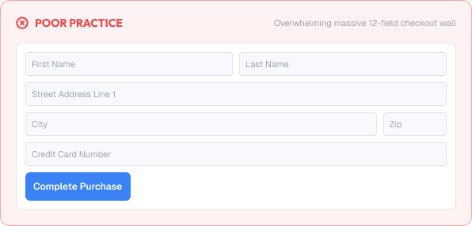

# Form Design Principles

Forms collect the data products need.

A well-designed form reduces friction, prevents errors, and makes the user's job feel easy.

A strong form is built around:

* Clarity
* Simplicity
* Feedback
* Trust
* Accessibility

---


# What You'll Learn

In this lesson, you'll learn:

* What forms are and why they matter
* The principle of "less is more"
* Form structure and grouping
* Label, input, helper relationships
* Ordering fields logically
* Reducing cognitive load
* Defaults and smart suggestions
* When to use one column vs two
* Common form mistakes
* Accessibility considerations
* How to design better forms

---

# Why Forms Matter

Forms are where users invest effort.

Good forms help users:

* Understand what to do immediately
* Fill fields faster
* Avoid errors
* Feel competent and in control

Bad forms cause:

* Abandonment
* Errors and frustration
* Mistrust of collected data
* Lost conversions

> Every extra field and every moment of confusion has a cost.

---

# Less is More

The shortest form that captures needed data is the best form.

Rules:

* Ask for only essential fields
* Remove optional fields unless they add real value
* Postpone optional info for later
* Break very long forms into steps

Before adding a field, ask:

```text
What action does this field enable?
Can it be collected later?
```

---

# Form Structure

Organize forms in a logical sequence.

## Sections

Group related fields.

```text
Account
  Name
  Email

Billing
  Card number
  Expiry
```

## Field order

Order fields in the most natural sequence:

```text
Name → Email → Password    (identity → access)
Total → Address → Payment  (shopping flow)
```

## One primary action

```text
[ Submit ]      ← only one prominent CTA
```

---

# Label / Input / Helper Relationship

The strongest pattern is:

```text
Label   ↑ closest (meaning)
Input
Helper / error    ↓ closest (context/feedback)
```

Rules:

* Labels above fields are the most scannable pattern
* Helper text lives under the field it describes
* Errors appear adjacent to the field, not only at the bottom
* Keep label alignment consistent (all left or all right)

---

# Reducing Cognitive Load

Forms should require as little thinking as possible.

Techniques:

* Use clear field names (not system jargon)
* Show expected format hints ("MM/YYYY")
* Use the correct input type for mobile keyboards
* Prefill obvious values (country, currency)
* Reveal password toggles when useful

Example improvement:

```text
Before:  Date (format type)
After:   Expiry    MM/YYYY  ← helper gives the format
```

---

# Input Types & Sizing

Inputs have standard sizes per context.

```text
Standard: 40–44px tall, full width of field group
Small/multi-field rows: keep equal width and height
```

If fields sit in a row (City/State/ZIP), give each the correct proportion and consistent height.

---

# Defaults & Autocomplete

Smart defaults shorten forms significantly.

Guidelines:

* Prefill what you already know
* Offer autocomplete where it helps (country, address)
* Keep derived values consistent (total, tax)
* Make all prefill editable, never locked

---

# One Column vs Two Columns

Simple question: which is clearer?

## One column

* Easiest for the eye to follow
* Best for most consumer forms
* Scans top-to-bottom naturally

## Two columns

* Fits more on the screen
* Can hide the natural reading order
* Best only for short, clearly-paired fields (First/Last)

Rule:

> Favor one column. Use two columns only when pairing is obviously natural.

---

# Practical Example

Imagine a check-out form.

## Poor Form Design



* 12 fields, many optional
* Labels sitting inside fields disappear when typing
* Random field order (payment before address)
* Two-column layout that scrambles the order
* No grouping or section headings
* No prefill for obvious values

### The Problem

Users feel lost, make errors, and many abandon.

---

## Good Form Design


* Step 1 asks only shipping, Step 2 only payment
* Labels above each field
* Natural order, clear sections
* Sensible defaults and autocomplete
* One primary "Continue" action per step

### The Result

The form feels quick and almost effortless, and completion rates rise.

---

# Common Form Mistakes

## Too Many Fields

Every optional field drains effort.

## Hidden Labels

Placeholders as labels vanish on typing.

## Confusing Order

Fields that fight the natural thought process.

## Unhelpful Validation

Errors discovered only at the end.

## No Grouping

A wall of fields with no structure.

## Two Competing CTAs

Multiple prominent buttons confuse the final step.

---

# Accessibility Considerations

Forms must work for all users.

Best practices:

* Label every field explicitly
* Provide visible focus states
* Give clear error text and paths to fix
* Support keyboard navigation fully
* Use proper input types & autocomplete attributes
* Announce validation changes to screen readers

Good forms improve usability for everyone.

---

# Lesson Checklist

Before you move on, make sure you understand:

* Why forms matter
* The "less is more" principle
* Form structure and grouping
* Label/input/helper relationships
* Logical field order
* Reducing cognitive load
* Defaults and autocomplete
* One vs two column
* Common form mistakes
* Accessibility principles

---