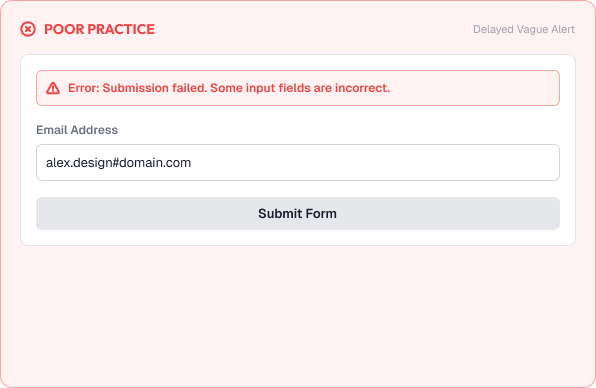
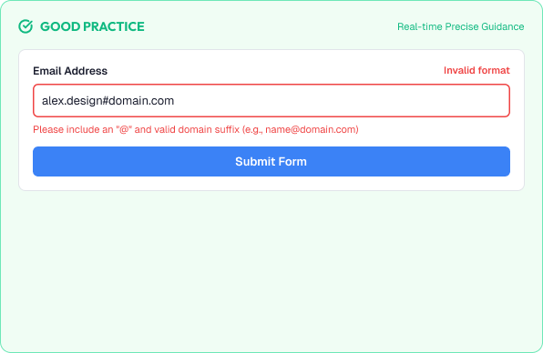

# Form Validation & Error Messaging

Errors are inevitable. Great interfaces make them painless.

Validation prevents mistakes and explains them clearly when they happen.

A strong validation system is built around:

* Prevention
* Immediate feedback
* Clear messaging
* Kindness
* Accessibility

---


# What You'll Learn

In this lesson, you'll learn:

* What validation is
* Why validation matters
* Inline vs on-submit validation
* Types of errors (input, system, permission)
* Writing clear error messages
* Where errors appear
* Preventing errors with format hints
* Success confirmation
* Common validation mistakes
* Accessibility considerations
* How to design better validation

---

# What is Validation?

Validation checks that user input is correct and usable.

Two jobs:

```text
Prevent errors  → format hints, constraints, options
Explain errors  → clear messages + guidance
```

The best error is one that never happens.

---

# Why Validation Matters

Validation protects both the user and the data.

Good validation helps users:

* Fix problems quickly
* Avoid confusion about requirements
* Trust that submitted data works

Poor validation causes:

* Repeated failed submissions
* Frustration and abandonment
* Unrecoverable mistakes

---

# Inline vs On-Submit

Two models for when validation runs.

## Inline

Check a field after the user leaves it (on blur).

Pros: fastest feedback, least effort.

Best for: format rules (email, phone, password strength).

## On-Submit

Check everything when the form is submitted.

Pros: catches all problems at once; standard fallback.

Best for: cross-field rules and final confirmation.

> Combine both: inline feedback while typing, on-submit as the safety net.

---

# Types of Errors

Errors fall into distinct categories with distinct treatments.

## Input Errors

```text
Required field empty
Wrong format
Value out of range
```

## System Errors

```text
Server unreachable
Save failed
Timed out
```

## Permission Errors

```text
Not authorized
Item locked
```

Each type needs its own tone and recovery path.

---

# Writing Clear Error Messages

An error message should answer three questions.

```text
What went wrong?
Why did it happen?
How do I fix it?
```

Guidelines:

* Say what happened in plain language
* State the problem, not the user's fault
* Tell the user exactly what to do next
* Reference the field by name

Example:

```text
Weak:  "Invalid input."
Good:  "Enter a valid email address, like name@example.com."
```

---

# Error Placement

Errors belong where action happens.

```text
Field error   → directly under the field
Form-level    → near the submit button
Banner        → for page-level or system errors
Toast         → for transient system failures
```

Rules:

* Keep field errors adjacent to the field
* Keep messages stable (no flicker or layout jump)
* Place form-level errors above the primary action

---

# Preventing Errors

Design validation to prevent mistakes first.

Techniques:

* Show format hints before typing ("MM/YYYY")
* Set constraints (max length, allowed characters)
* Use dropdowns and pickers instead of free text
* Disable impossible actions with explanation ("Needs 6+ characters")

> If a rule matters, surface it before the error.

---

# Success Confirmation

Good UX confirms success, not just failures.

Patterns:

```text
Green tick + "Saved" message
Success banner after submit
Clear state change (button → done)
```

Rules:

* Confirm completion clearly
* Never leave the user guessing whether it worked
* Allow correction (edit/dismiss) where relevant

---

# Loading and Disabled States

Prevent double-submits and clarify waiting.

Patterns:

```text
Pending: button shows spinner + "Saving…", disabled
Result:  success banner OR error banner with next steps
```

Never silently consume a submission.

---

# Practical Example

Imagine a sign-up form with password rules.

## Poor Validation



* Errors appear only after clicking Submit
* "Invalid password" with no guidance
* Error color alone, inline, but far from the field
* Error text overlaps layout when it appears
* No success feedback after signing up

### The Problem

Users repeat submissions, guessing at rules, and wonder if anything worked.

---

## Good Validation



* Subtle requirement hint ("8+ characters, 1 number") shown from the start
* As the user types, each rule ticks green or marks red
* On blur, an inline message appears under the field with a fix
* On submit, remaining errors are listed near the button
* A clear success confirmation appears afterward

### The Result

Users never guess, fix mistakes immediately, and feel confident they're done.

---

# Common Validation Mistakes

## Color Only

Red alone is invisible to color-blind and screen-reader users.

## No Fix Guidance

Stating the problem without telling how to solve it.

## Late Feedback

Detecting errors only at the very end.

## Vague Messages

Generic "invalid" without specifics.

## Error Placement Chaos

Errors appearing far from the fields they describe.

## Harsh Tone

Blaming language ("You forgot...") creates stress.

---

# Accessibility Considerations

Errors must be perceivable for everyone.

Best practices:

* Announce errors to screen readers (aria-live)
* Connect errors to their fields programmatically
* Never rely on color only — add icons and text
* Keep validation feedback accessible at zoom
* Provide ways to navigate directly to each error

Good validation improves usability for all users.

---

# Lesson Checklist

Before you move on, make sure you understand:

* What validation is
* Inline vs on-submit validation
* Types of errors
* Writing clear error messages
* Error placement
* Preventing errors
* Success confirmation
* Common validation mistakes
* Accessibility principles

---