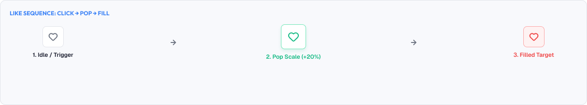
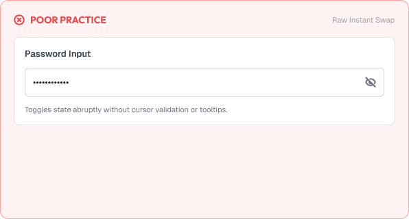
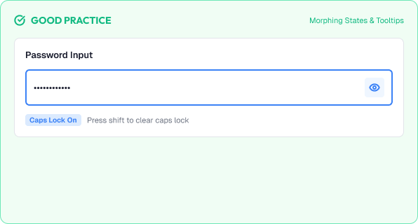

# Micro-interactions

Micro-interactions are the tiny moments of feedback that make an interface feel responsive.

They are the difference between a product that feels alive and one that feels lifeless.

A strong micro-interaction system is built around:

* Feedback
* Delight
* Restraint
* Consistency
* Accessibility

---



# What You'll Learn

In this lesson, you'll learn:

* What micro-interactions are
* Why they matter
* The anatomy of a micro-interaction
* Common examples (buttons, toasts, switches, likes)
* Feedback that builds trust
* Timing and ease
* Delight without distraction
* Haptic and audio cues
* Common micro-interaction mistakes
* Accessibility considerations
* How to design effective micro-interactions

---

# What is a Micro-interaction?

A micro-interaction is a small, functional moment of feedback that accompanies a single action.

Examples:

```text
Button press-down on click
Liked toggle heart pop
Toast slide-in on save
Switch thumb slide on toggle
Spinner while a file uploads
```

They are small, but they communicate:

```text
The action was received
The action is working
The action completed
```

---

# Why Micro-interactions Matter

Micro-interactions shape perceived quality.

Good micro-interactions:

* Confirm every action instantly
* Make waiting feel shorter
* Add personality without clutter
* Build trust in the product

Missing or broken micro-interactions:

* Feel unresponsive ("did my click work?")
* Make flows feel hollow
- Erode confidence over time

> Small moments compound into overall feeling.

---

# Anatomy of a Micro-interaction

Every micro-interaction has the same structure.

```text
Trigger    → the event (click, swipe, toggle)
Rules      → how it responds (state, values)
Feedback   → how it shows (visual, motion, sound)
Loops & modes → repeated / ongoing feedback
```

Example — a Like button:

```text
Trigger  → user taps like
Rules    → icon fills, count +1
Feedback → heart pops with a bounce
```

---

# Common Micro-interactions

## Buttons

On press:

```text
Press-down: scale 1 → 0.97
Release: scale back to 1
```

Instant, subtle, physical.

## Toggles & Switches

Thumb slides; track-color changes.

Timing: 150–200ms.

## Toasts & Notifications

Enter with a fade + mild slide.

Self-dismissing after 3–5s.

## Acknowledgment (Likes, Stars)

Small bounce/pop on the icon.

Count updates with a quick tick.

## Progress

Skeleton shimmer, spinner, or progress bar.

Keep the user informed.

---

# Feedback Builds Trust

Good feedback answers three questions.

```text
Did it register?      → instant subtle response
Is it processing?     → loading state, clear progress
Is it finished?       → completion signal
```

Examples:

* Clicking Save → button shows "Saving…" then "Saved ✓"
* Submitting → the form shows a success state
* Deleting → the row exits with an animation

> Never leave users waiting in silence.

---

# Timing and Easing

Micro-interactions must feel quick.

Durations:

```text
Micro press:   60–100ms
Standard pop:  100–200ms
State switch:  120–250ms
Toast entry:   150–300ms
```

Easing:

* Use ease-out for entrances
* Use fast snaps for presses
- Avoid long, floaty motions for small feedback

If the effect is not nearly imperceptible-fast, it's too slow.

---

# Delight Without Distraction

Delight should not hijack the task.

Guidelines:

* Highlight the action, not the show
* Keep the flourish under one second
* Add personality in empty, playful moments (empty states)
* Reserve drama for special achievements

Rule:

> Delight is a spice, not the meal.

---

# Haptics and Audio

On native platforms, add senses when appropriate.

* Haptics → subtle tap for confirmations
* Audio → short ticks for toggles (often default-off)

Guidelines:

* Keep audio optional and quiet
* Avoid repeated sound loops
* Respect system accessibility and mute settings

---

# Practical Example

Imagine a password toggle and a save button.

## Poor Micro-interactions



* Save button gives no feedback (users click again)
* Password "eye" toggles instantly with no visual change
* Toast pops in abruptly and covers content
* Like counter updates silently with no acknowledgment

### The Problem

Users can't tell if actions worked, and the app feels unresponsive.

---

## Good Micro-interactions



* Save button: press-down, then "Saved ✓" confirm state
* Password toggle: eye icon changes and a quick fade accompanies it
* Toast: slides in from the top-right and auto-dismisses
* Like: heart pops, count ticks, profile color fills

### The Result

Every tap feels acknowledged, and the interface feels thoughtfully crafted.

---

# Common Micro-interaction Mistakes

## Overdoing It

Every hover animating drains significance.

## Too Slow

Small moments that take a second feel heavy.

## No Confirmation

Actions that complete invisibly.

## Random, Inconsistent Effects

Each element animating differently.

## Ignoring Reduced Motion

Animations that force users to endure unwanted motion.

## Confusing Feedback

Motion that implies an action different from the real one.

---

# Accessibility Considerations

Micro-interactions must be inclusive.

Best practices:

* Honor reduced-motion preferences (use fades/opacity)
* Never convey critical states solely through animation
* Keep audio cues optional
* Ensure keyboard-complete triggers get the same feedback
* Test with a wide range of users and devices

Good micro-interactions improve life for everyone.

---

# Lesson Checklist

Before you move on, make sure you understand:

* What micro-interactions are
* Why they matter
* Their anatomy (trigger, rules, feedback)
* Common examples
* How feedback builds trust
* Duration and easing
* Delight without distraction
* Haptics and audio
* Common mistakes
* Accessibility principles

---