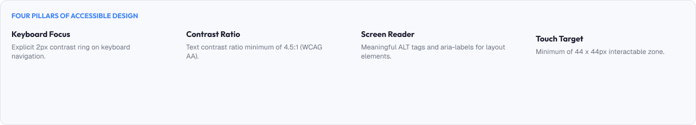
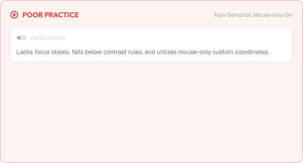
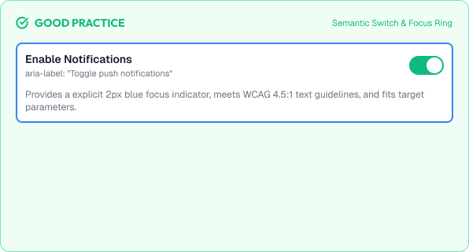

# Accessibility Fundamentals

Accessibility means designing for everyone, regardless of ability.

Accessible products remove barriers that exclude people — and they usually become better for all users.

A strong accessible product is built around:

* Inclusivity
* Perceivability
* Operability
* Understandability
* Robustness

---



# What You'll Learn

In this lesson, you'll learn:

* What accessibility is
* Why accessibility matters
* The four WCAG principles (POUR)
* WCAG levels (A, AA, AAA)
* Common disabilities and barriers
* Semantic HTML and ARIA
* Keyboard accessibility
* Assistive technologies
* Accessibility testing
* Common accessibility mistakes
* Building inclusive products

---

# What is Accessibility?

Accessibility (a11y) is the practice of making products usable by people with diverse abilities.

Everyone benefits:

```text
Good contrast    → readable in sunlight
Keyboard support → fast power users
Clear labels     → clearer for everyone
```

> Accessible design is good design.

---

# Why Accessibility Matters

Accessibility is a legal, ethical, and product-quality issue.

## People

About 1 in 6 people worldwide has a significant disability.

## Legal

Many countries require accessible software (ADA, EAA, Section 508).

## Product

Accessible products:

* Reach more users
- Reduce errors
- Improve SEO
- Build trust

---

# The Four Principles: POUR

WCAG organizes accessibility into four principles.

## Perceivable

Information must be presentable in different ways.

```text
Alternatives for images
Text alternatives for audio
Contrast and distinguishability
```

## Operable

Interfaces must be operable without mouse-only.

```text
Full keyboard support
Enough time
No seizure triggers
```

## Understandable

Information and operation must be understandable.

```text
Readable language
Predictable behavior
Help and error recovery
```

## Robust

Content must be robust for assistive tech.

```text
Valid semantics
Compatible with screen readers
Resilient structure
```

---

# WCAG Conformance Levels

WCAG scores conformance in levels.

| Level | Meaning                                  | Typical Rule                       |
| :------ | :------------------------------------------ | :----------------------------------- |
| **A** | Minimum, must-have for basic access      | Keyboard operable, alt text        |
| **AA** | Standard target for most products        | 4.5:1 contrast, focus visible      |
| **AAA** | Enhanced (best effort, optional)         | 7:1 contrast, sign-language videos |

Industry default:

> Target **WCAG 2.x AA** as the baseline.

---

# Common Barriers

What accessibility actually prevents:

## Visual

* Low-vision and blind users → screen readers, zoom
* Color-blind users → reliance on color alone

## Motor

* Limited dexterity → keyboard-only, switches, voice

## Cognitive

* Learning and memory differences → simple structure

## Auditory

* Deaf and hard-of-hearing users → captions, transcripts

Each barrier has a design response.

---

# Semantic HTML First

Native elements carry meaning for free.

```text
<button>  → keyboard + semantics built-in
<a href>  → focus, activation, navigation
<input>   → forms + autocomplete
<nav>, <header>, <main> → landmarks
```

Rules:

* Use native elements whenever possible
* Add ARIA only when semantics are missing
* Never fake a button with a div + event

> Every custom, non-semantic control duplicates work that HTML already solved.

---

# Keyboard Accessibility

Everything must work by keyboard.

Core interactions:

```text
Tab        → move forward
Shift+Tab  → move backward
Enter/Space → activate
Arrow keys → navigate within a group
Escape     → dismiss
```

Rules:

* Never trap focus without an escape
* Keep a logical focus order matching visuals
* Restore focus after modals close

---

# Assistive Technologies

Designs must perform alongside assistive tech.

Examples:

```text
Screen readers (VoiceOver, NVDA, JAWS)
Screen magnifiers
Switch and eye-tracking input
Voice control (Dragon, OS-level)
```

Reality reminders:

* Alt text describes meaning, not just the file
* Headings and landmarks create navigation
* Live regions announce dynamic changes

---

# Testing Accessibility

Accessibility is verified, not assumed.

Manual tests:

```text
Keyboard-only run-through
Zoom to 200%
Color-contrast checker
Screen reader pass
```

Automated tests:

```text
Lint + axe-core scans
Pa11y / Lighthouse accessibility checks
CI-integrated a11y tests
```

Best workflow:

```text
Design-time checks
Development lint
Automated CI
Manual QA with real assistive tech
```

---

# Practical Example

Imagine a settings page with a theme toggle.

## Inaccessible Version



* The toggle is a `div` with a click handler
* Only mouse users can operate it
* No screen-reader name or state
* No focus outline visible
* Label is only decorative color

### The Problem

Keyboard, screen-reader, and many other users simply cannot use the page.

---

## Accessible Version



* A real checkbox or `role="switch"` with a label
* Full keyboard support and visible focus
* State announced to screen readers
* Contrast-safe on and off states
* Color + icon + label, not color alone

### The Result

Every user, with any tool, can complete the task.

---

# Common Accessibility Mistakes

## Color-Only Meaning

Status conveyed strictly by hue.

## Tiny Targets

Sub-44px interactive areas.

## No Alt Text or Wrong Alt

Missing descriptions for informative images.

## Div-Based Buttons

Custom controls lacking semantics and keyboard support.

## No Visible Focus

Focus that disappears for keyboard users.

## Motion Without Options

Animations that ignore reduced-motion settings.

---

# Accessibility Considerations

A checklist before release:

* All interactive elements keyboard-operable
* Focus visible and not trapped
* Contrast meets AA minimums
* Images have correct alt text
* Forms have labels + clear errors
* No flashing beyond safe thresholds
* Reduced motion respected

> Accessibility is continuous, not a one-time sprint.

---

# Lesson Checklist

Before you move on, make sure you understand:

* What accessibility is
* Why it matters
* The four POUR principles
* WCAG levels (A, AA, AAA)
* Common barriers
* Semantic HTML and ARIA
* Keyboard accessibility
* Assistive technologies
* Testing methodology
* Common accessibility mistakes

---