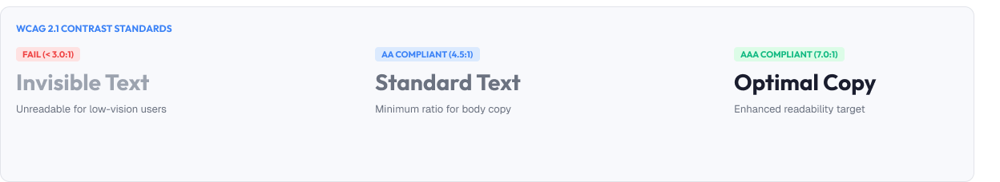
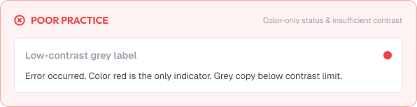
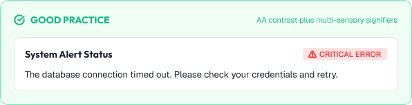

# Accessible Color & Contrast

Color accessibility ensures interfaces are readable for everyone.

It is not about aesthetics — it is about whether information can be perceived at all.

A strong accessible color system is built around:

* Contrast
* Redundancy
* Color-blind safety
* Consistency
* Usability for everyone

---



# What You'll Learn

In this lesson, you'll learn:

* Why accessible color matters
* Contrast ratio basics
* WCAG contrast requirements
* Testing text, UI, and graphics
* Color-blind considerations
* Never relying on color alone
* Accessible palettes and themes
- Focus and selection contrast
* Common color accessibility mistakes
* How to apply accessible color

---

# Why Accessible Color Matters

Contrast determines readability.

Poor contrast excludes:

* Low-vision users
* Users in bright environments (sunlight)
* Older users
* Users with color deficiencies

Accessible color also:

* Improves legibility for everyone
* Meets legal requirements
- Reduces user frustration

> If users cannot read it, the content does not exist.

---

# Contrast Ratio

Contrast is the luminance difference between two colors.

```text
1:1  = two identical colors (invisible)
21:1 = black vs white (maximum)
```

Formula (simplified):

```text
Contrast = (L1 + 0.05) / (L2 + 0.05)
```

L1 = lighter color, L2 = darker color.

Higher ratio = easier to read.

---

# WCAG Requirements

WCAG sets required minimums.

| Content                    | Minimum Ratio |
| :--------------------------- | :-------------- |
| **Normal text**       | **4.5 : 1** |
| **Large text** (≥24px, or ≥18.66px bold) | **3 : 1** |
| **UI components & graphics** | **3 : 1** |
| *AAA text*             | *7 : 1*    |

## 4.5:1 in practice

```text
Dark gray (#555) on white     → passes
Light gray (#999) on white    → often fails
White on mid-blue (#3B82F6)   → check before shipping
```

Test exact pairs, not "good enough" pairs.

---

# What to Test

## Text

Body text, labels, placeholders, captions, links.

## UI Components

Buttons, borders, icons, focus rings:

```text
Component boundaries: 3:1 against adjacent colors
Icons and glyphs: 3:1 against background
```

## Focus Indicators

Focus ring should contrast against everything around it.

## Error/Success States

Messages must be readable in their context.

> Test every pairing that carries meaning, including disabled and muted states.

---

# Common Failures by Symptom

## Placeholder Text

`#C0C0C0` grays that no longer read as content.

## Disabled States

Opacity 30% controls where users need to read the label.

## Text on Images

Overlaying text without a scrim.

## Subtle Links

Muted "link colors" that fail against their background.

---

# Color-Blind Safety

About 8% of men and 0.5% of women have color vision deficiency (CVD).

CVD variants:

```text
Red-green (most common)
Blue-yellow
Complete (rare)
```

Color-blind-safe rules:

* Prefer blue as the primary hue (leftmost / safest)
* Avoid relying on red/green differences alone
* Use shape, icons, patterns, and text concurrently

Bad example:

```text
Green = OK, Red = error   (invisible to red-green CVD)
```

Good example:

```text
Icon ✓/✗ + label + color  (works for everyone)
```

---

# Never Color Alone

Meaning must not depend on color perception.

Rules:

* Status: pair with icon or text
* Selection: pair with border, fill, and label
* Links: underlined or texturally distinct
* Charts: add patterns or labels

Example:

```text
Only green dot        → meaningless to some users
Green dot + "Paid"     → clear for everyone
```

---

# Accessible Palettes

Design palettes that pass by construction.

Guidelines:

* Keep default text at high enough contrast
* Provide sufficient surface-to-text separation
* Reserve very light grays for decoration only
* Test every semantic color on both light and dark

Token-level approach:

```text
text.primary   = 7:1 contrast
text.secondary = 4.5:1 contrast
text.muted     = 4.5:1 contrast (never below)
border.default = 3:1 contrast where meaningful
```

---

# Theme & Dark Mode Contrast

Contrast rules apply in every theme.

In dark mode:

* Off-white text on dark surfaces still needs 4.5:1
* Saturated accents may fail against dark backgrounds
* Semantic colors need dark-themed variants

Test each theme; do not assume a light-theme pass transfers.

---

# Practical Example

Imagine a status badge in a table.

## Inaccessible Color



* A green badge and a red badge are exact same shade-weight
* No icon, no label — only color
* Both fail 3:1 against the white background

### The Problem

Red-green color blind users cannot tell "Paid" from "Overdue", and low-vision users see two near-invisible badges.

---

## Accessible Color



* "Paid" → green fill + checkmark + label
* "Overdue" → red fill + warning icon + label
* Each badge passes 3:1 against the page
* Text inside passes AA

### The Result

Anyone can read the status instantly — that's the entire point.

---

# Common Color Accessibility Mistakes

## Contrast Overlooked

Shipping grays and pastels that "look okay" but fail.

## Color as Sole Indicator

Status shown only as a hue.

## Testing Only Main Text

Labels, placeholders, icons, and borders untested.

## Dark Mode Assumptions

Contrast tested only in light mode.

## Saturated on Saturated

Accent text on accent backgrounds that disappear.

## Disabled as "Invisible"

Faded controls where users still must read content.

---

# Accessibility Considerations

A concise accessible-color checklist:

* Normal text ≥ 4.5:1
* Large text ≥ 3:1
* UI components & graphics ≥ 3:1
* Never color-alone meaning
* Test light and dark themes
* Verify with a contrast tool
* Check with a CVD simulator

---

# Lesson Checklist

Before you move on, make sure you understand:

* Why accessible color matters
* Contrast ratio basics
* WCAG requirements
* What to test (text, UI, graphics)
* Common failures
* Color-blind considerations
* Never relying on color alone
* Accessible palettes and themes
* Common color mistakes
* Testing methods

---