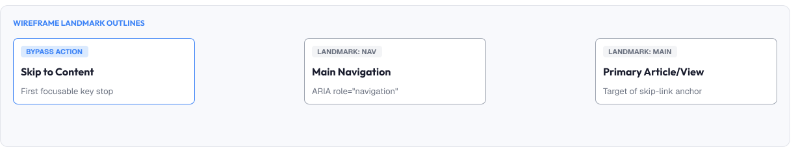
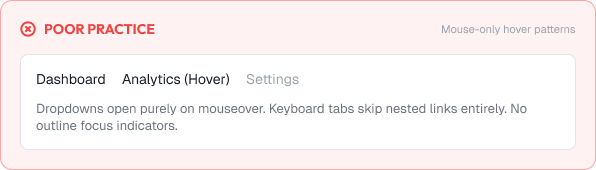
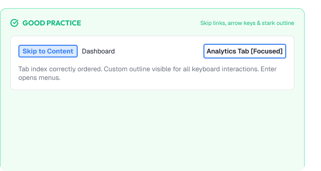

# Accessible Navigation

Navigation is how users find their way through a product.

If users cannot navigate, nothing else matters.

Accessible navigation is built around:

* Clarity
* Keyboard operability
* Predictability
* Assistive technology support
* Forgiving structure

---



# What You'll Learn

In this lesson, you'll learn:

* Why accessible navigation matters
* Semantic structure (landmarks, headings, links)
* Keyboard navigation
* Focus management
* Skip links
* Menus, dropdowns, and tabs
* Breadcrumbs and pagination
* Navigation on mobile
* Common navigation mistakes
* Accessibility considerations
* How to build accessible navigation

---

# Why Accessible Navigation Matters

Navigation is the map of the interface.

Good navigation helps all users:

* Know where they are
* Understand the structure
* Reach goals quickly
* Recover from getting lost

For assistive tech users, navigation is often the only map:

```text
Screen reader users → landmarks + headings
Keyboard users      → tab + arrow order
Voice users         → predictable labels
```

---

# Semantic Structure

Structure gives assistive tech a map.

## Landmarks

Code regions with meaning:

```text
<header>  → banner
<nav>     → navigation
<main>    → main content
<footer>  → contentinfo
```

## Headings

A logical, ordered outline:

```text
H1  ← page title
  H2 ← sections
    H3 ← subsections
```

Rules:

* One H1 per page
* Never skip heading levels
* Keep heading text meaningful

---

# Keyboard Navigation

Everything reachable and operable by keyboard.

Core expectations:

```text
Tab        → next interactive element
Shift+Tab  → previous
Enter/Space → activate
Escape     → close menus/dialogs
```

Rules:

* Keep a logical order that matches visuals
* Never trap focus (except modals, and offer Escape)
* Restore focus after menus and dialogs close

---

# Focus Management

Focus must be visible and predictable.

When content changes:

* Opening a menu → move focus into it
* Closing a menu → return focus to the trigger
* Loading new content → announce or move focus there

Focus order expectations:

```text
1. Primary navigation
2. Main content
3. Supporting or secondary content
```

> Users should never have to guess where the keyboard "is".

---

# Skip Links

Skip links jump directly to content.

Why:

* Keyboard users tab through every nav item first
* Screen reader users hear all nav labels first

Implementation:

```text
<a href="#main-content" class="skip-link">Skip to content</a>
```

The link is invisible until focused, then appears at the top.

> Skip links are the first focusable element on the page.

---

# Menus, Dropdowns, and Tabs

Interactive navigation needs explicit semantics.

## Menus & Dropdowns

Patterns:

```text
Button trigger with aria-haspopup
List of options receiving arrow-key navigation
Escape closes and returns focus
```

## Tabs

Patterns:

```text
Left/right arrows move between tabs
Tab panels announced when shown
Current tab identified (aria-selected)
```

Never hide menu content so only hover reveals it — keyboard and touch need explicit triggers.

---

# Breadcrumbs & Navigation Bars

## Breadcrumbs

Provide trail and context.

Guidelines:

* Use `<nav aria-label="Breadcrumb">`
* Separate levels meaningfully
* Current page marked as current

## Navigation bars

Guidelines:

* Use a `<nav>` landmark once per page
* Distinguish nav visually from content
* Keep labels short and unique

---

# Current Location

Users must know where they are.

Signals:

```text
Visual: active tab styling
Text:   "current" or aria-current
Trait:  breadcrumbs + page title
```

Never rely on color alone to indicate current location.

---

# Mobile Navigation

Small screens add constraints.

Guidelines:

* Keep labeled, reachable menus
* Ensure the hamburger has an accessible name
* Close menus on Escape
* Give adequate touch targets (44px)

Watch for:

```text
Menus that slide away with no focus return
Gestures without keyboard equivalents
```

---

# Practical Example

Imagine an e-commerce category menu.

## Inaccessible Navigation



* The menu opens only on hover with no keyboard path
* Tabs are custom divs with no roles
* No skip link; keyboard users tab through 40 items first
* The active page shown by a subtle color difference
* Focus disappears when the menu closes

### The Problem

Keyboard and screen reader users effectively hit a wall.

---

## Accessible Navigation



* Dropdown opens on click/keyboard with arrow-key traversal
* Tabs use proper roles and arrow keys
* A skip link jumps keyboard users to content
* Active page labeled and contrast-visible
* Escape closes menus and restores focus

### The Result

Every user — by keyboard, screen reader, or pointer — can move through the site.

---

# Common Navigation Mistakes

## Mouse-Only Menus

Hover-only dropdowns exclude keyboard and touch.

## Focus Vanishing

Closing a menu leaves the keyboard "somewhere".

## Missing Landmarks

Screen reader users cannot find main content.

## Broken Heading Order

Skipped levels destroy the outline.

## Color-Only "Current"

Active states invisible to CVD and low-vision users.

## No Skip Link

Repetitive navigation penalizes keyboard users.

---

# Accessibility Considerations

A navigation checklist:

* Landmarks present and labeled
* Logical heading outline
* Full keyboard operation
* Visible + predictable focus
* Skip link first
* Menus/tabs use correct semantics
* Current location clear (not color only)
* Reduced-motion honored for hide/show

---

# Lesson Checklist

Before you move on, make sure you understand:

* Why accessible navigation matters
* Landmarks and headings
* Keyboard navigation
* Focus management
* Skip links
* Menus, dropdowns, and tabs
* Breadcrumbs and navigation bars
* Mobile navigation
* Common navigation mistakes
* Accessibility principles

---