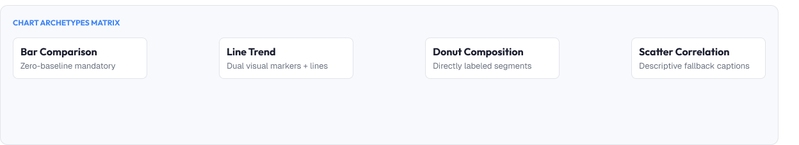
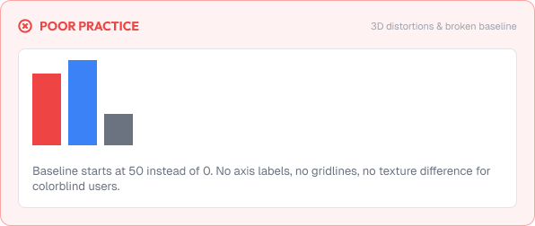
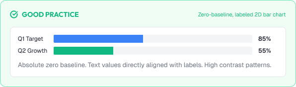

# Data Visualization Basics

Data visualization turns numbers into understanding.

A chart's job is to reveal patterns and truths that raw numbers hide.

Good data visualization is built around:

* Accuracy
* Clarity
* Purpose
* Honesty
* Accessibility

---



# What You'll Learn

In this lesson, you'll learn:

* What data visualization is
* Why it matters
* Choosing the right chart
* Chart anatomy
* Common chart types
* Encoding data visually
* Decluttering and focus
* Chart labels and legends
* Honesty in data
* Accessibility considerations
* Common visualization mistakes
* How to design better charts

---

# What is Data Visualization?

Data visualization is representing data as visual objects.

```text
Numbers  →  bars, lines, dots, areas, colors
```

Good visualization:

* Reveals patterns quickly
* Compares values fairly
* Guides decisions

---

# Why Visualization Matters

Humans process images faster than numbers.

Effective charts help users:

* Grasp trends in seconds
* Spot outliers instantly
* Compare quantities honestly
* Communicate findings to others

Poor charts:

* Mislead decisions
- Confuse stakeholders
- Erode trust in the product

> The chart is the argument. Design it carefully.

---

# Choosing the Right Chart

Each chart type answers a specific question.

| Question                  | Best Chart                      |
| :--------------------------- | :-------------------------------- |
| Compare categories         | Bar chart                        |
| Show a trend over time     | Line chart                       |
| Show parts of a whole      | Donut / stacked bar              |
| Distributions              | Histogram                        |
| Relationships / 2 variables | Scatter plot                    |
| Geographic data            | Map                              |
| Exact table-like values    | Table (not a chart)              |

Rule:

> Match the chart to the question you want to answer.

---

# Chart Anatomy

Common chart parts:

```text
Axis (x / y)
Tick labels
Grid lines
Series (bars, lines, points)
Legend
Tooltip / labels
Title
```

Rules:

* Label axes clearly
- Keep grid lines subtle
- Make the data the loudest element

---

# Common Chart Types

## Bar Chart

Best for comparing categories.

```text
Bars start at zero baseline.
Widths uniform, spaces consistent.
```

## Line Chart

Best for trends over continuous time.

```text
Clear points, readable axes.
Avoid too many series.
```

## Donut / Pie

Best for showing one part-of-whole comparison.

```text
Use sparingly (max ~6 slices).
A stacked bar is often clearer.
```

## Scatter Plot

Best for showing relationships between two variables.

---

# Encoding Data Visually

Visual properties carry meaning.

```text
Position   → strongest encoder
Length     → strong for comparison
Area       → weaker (used in bubbles)
Color      → good for categories
Angle/slope → use with care
```

Layout order of reliability:

```text
Position > Length > Angle > Area > Color hue
```

Prefer the strongest encodings for the most important data.

---

# Decluttering

Charts should show data, not decoration.

Remove:

```text
Unnecessary grid lines
Heavy 3D effects
Unneeded shadows
Excess colors
Rulers/background art
```

Rule:

> If removing an element does not reduce clarity, remove it.

---

# Labels, Legends, Tooltips

People need context to read charts.

Guidelines:

* Label data points directly when practical (better than a legend)
* Keep axes labeled with units
* Use tooltips for detail, never for essentials
* Keep legends ordered to match series order
* Formats: `$1.2M`, `42%`, `3.4k` — consistent per chart

---

# Honesty in Data

Visualization must not lie.

Common dishonesty patterns:

```text
Broken Y-axis (starts above zero)  → exaggerates changes
Inconsistent baselines             → misleads comparison
Cherry-picked time ranges          → hides context
Area/3D distortion                 → misrepresents amounts
Color that implies safety/danger   → misleads emotion
```

Rules:

* Start bar charts at zero
* Show totals and context
* Label methodology and source
* Keep axis scales truthful

---

# Practical Example

Imagine a monthly revenue card.

## Poor Visualization



* A line chart using 3D gradient effects
* Y-axis starts at 85% to exaggerate the dip
* Too many series colors to distinguish
* No axis labels ("is this thousands or millions?")
* Legend placed far from the data

### The Problem

Users cannot compare honestly, and management makes decisions on a distorted chart.

---

## Good Visualization



* Plain bar chart, starting at zero
* One clear accent for highlights
* Labels: "Monthly revenue ($K)" and clean tick values
* Direct labels on key points
* A short caption noting the source and period

### The Result

Patterns are obvious, comparisons are honest, and the insight earns trust.

---

# Common Visualization Mistakes

## Wrong Chart Type

Lines for categories, pies for several slices, etc.

## Misleading Scales

Break a zero baseline to exaggerate.

## Chart Junk

3D, heavy grids, and shadows that obscure data.

## Too Many Colors

Unrelated hues competing for attention.

## Missing Labels

Charts whose meaning requires guessing.

## Color as the Only Distinction

Series or values invisible to color-deficient users.

---

# Accessibility Considerations

Charts must be perceivable for everyone.

Best practices:

* Use patterns/labels in addition to color
* Provide a text table or description as alternative
* Keep high contrast on all chart elements
* Ensure tooltip content is keyboard-reachable
* Test at zoom and on small screens

Good charts serve all users.

---

# Lesson Checklist

Before you move on, make sure you understand:

* What data visualization is
* Why it matters
* Choosing the right chart
* Chart anatomy
* Common chart types
* Encoding data visually
* Decluttering
* Labels, legends, tooltips
* Honesty in data
* Common mistakes
* Accessibility principles

---