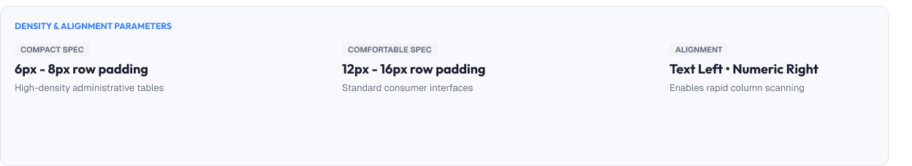
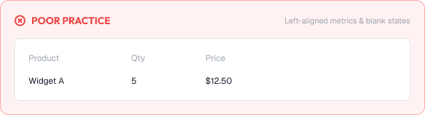
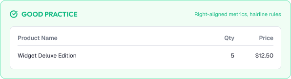

# Tables & Data Density

Tables are the workhorse of data-heavy interfaces.

A great table lets users scan, compare, and find data without thinking.

Strong tables are built around:

* Scannability
* Alignment
* Density control
* Sorting and filtering
* Accessibility

---



# What You'll Learn

In this lesson, you'll learn:

* Why tables matter
* Table anatomy
* Column alignment
* Row and cell structure
* Density levels
* Sorting, filtering, and pagination
* Empty and loading states
* Tables on mobile
* Common table mistakes
* Accessibility considerations
* How to build better tables

---

# Why Tables Matter

Tables present structured data.

Users rely on tables to:

* Scan rows quickly
* Compare values across columns
- Find specific records
- Sort and filter large sets

A messy table hides the answer and multiplies friction.

---

# Table Anatomy

Every table shares a standard structure.

```text
┌──────────┬──────────┬──────────┐
│ Header 1 │ Header 2 │ Header 3 │   ← column headers
├──────────┼──────────┼──────────┤
│   ...    │   ...    │   ...    │   ← data rows
├──────────┼──────────┼──────────┤
│  footer / pagination            │
└─────────────────────────────────┘
```

Parts:

* Column headers
* Data rows and cells
* Row separators / zebra stripes
* Selection and action columns
* Pagination / density controls

---

# Column Alignment

Alignment affects how fast values compare.

Rules:

```text
Numbers       → right-aligned
Text          → left-aligned
Dates         → consistency (same format)
Boolean / checkbox → centered
```

Example:

```text
Name        Quantity   Price
Apples      12         $24.00
Bananas     7          $14.00
```

Column headers align with their data.

---

# Row Structure

Rows should be easy to track.

Patterns:

```text
Row height:  40–48px comfortable, 32–36px dense
Row divider:  hairline border or alternating shade
No vertical borders  → reduces noise
```

Selection patterns:

```text
Checkbox column + row highlight
Row hover for affordance
Selected row visibly highlighted
```

---

# Density

Data volume vs readability is a constant trade-off.

| Density    | Row Height   | Best For                    |
| :----------- | :------------- | :---------------------------- |
| **Comfortable** | 48px       | General apps                |
| **Standard** | 40px       | Default for most interfaces |
| **Dense**  | 32px       | Large datasets, analysts    |

Guidelines:

* Default to Standard/Comfortable
* Offer a density switcher for power users
* Never drop below readable text size
* Keep consistent density within one table

---

# Sorting, Filtering, Pagination

Tables must handle volume.

## Sorting

* Clickable column headers with clear direction
* Persist the sort choice
* Show the active sort indicator

## Filtering

* Filters near the table (search, dropdowns, chips)
* Reflect active filters in the UI
* Easy to clear

## Pagination vs infinite scroll

* Pagination: predictable, good for large arrays
* Infinite scroll: natural for feeds
* Show counts ("Page 3 of 20")

---

# Empty & Loading States

Tables in waiting time need clarity.

## Loading

```text
Skeleton rows that match the real layout
Keeps the page stable (no layout jump)
```

## Empty

```text
Icon + clear message + action ("Create your first project")
Never a blank box with a border
```

---

# Tables on Mobile

Tables are the hardest to shrink well.

Options:

```text
1. Responsive scroll  → keep table, horizontal scroll
2. Card layout        → each row becomes a card
3. Key columns first  → show essentials, "view all"
```

Rules:

* Keep headers visible when horizontally scrolling
* Provide search/sort even on small screens
- Favor card layouts for simple tables

---

# Practical Example

Imagine an orders dashboard.

## Poor Table Design



* Numbers left-aligned, headers misaligned
* No zebra or dividers — rows blur together
* 56px rows everywhere "to be safe"
* No sorting or filtering controls
* Empty state is a blank bordered box
* Table overflows on mobile with clipped columns

### The Problem

Users cannot compare totals, find records, or understand status — the table fails at its job.

---

## Good Table Design



* Numbers right-aligned, dates consistent, columns aligned
* Hairline dividers + subtle row hover
* 40px rows, with a density switcher
* Sortable headers, filters, pagination with counts
* Helpful empty state with a CTA
* A "key-columns" mobile card view

### The Result

The table reads at a glance, scales to large data, and works on every screen.

---

# Common Table Mistakes

## Misaligned Columns

Readability collapses instantly.

## Wall of Text

Full-width, unstyled rows that hide the data.

## Over-Dense or Over-Spacious

Extremes that hurt either scanning or usability.

## No Sorting or Filtering

Huge tables with zero exploration tools.

## Empty State as Blank Box

Users don't know the table is "empty on purpose".

## Unreadable Mobile

Clipped columns and confusing horizontal scroll.

---

# Accessibility Considerations

Tables must be accessible.

Best practices:

* Use semantic `<table>` structure with header association
* Keep row/cell relationships perceivable
* Use live regions for loading/updates
* Maintain keyboard navigation (sort, pagination)
* Preserve contrast through all states
* Provide text alternatives for complex tables

Good tables work for everyone.

---

# Lesson Checklist

Before you move on, make sure you understand:

* Why tables matter
* Table anatomy
* Column alignment
* Row structure
* Density levels
* Sorting, filtering, pagination
* Empty and loading states
* Mobile tables
* Common table mistakes
* Accessibility principles

---